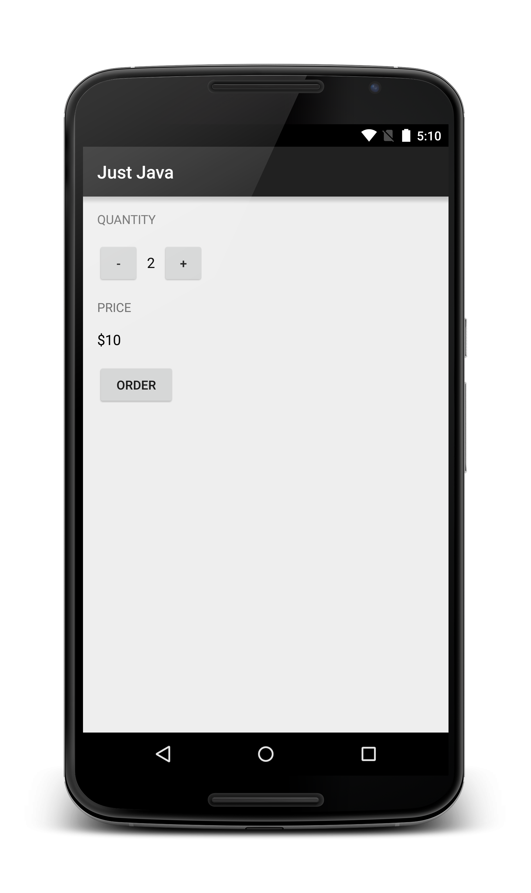

# Making An App Interactive
1. Look at the <a href="https://s3.amazonaws.com/video.udacity-data.com/topher/2017/July/595ab9de_common-android-views-cheat-sheet/common-android-views-cheat-sheet.pdf">Common Views cheat sheet</a>
1. <a href="https://www.jetbrains.com/help/idea/reformat-and-rearrange-code.html">How to reformat source code</a>  *code> reformat code* -> selected text **to reformat the code: fix the spacing and tabs.**
2. <a href="https://www.jetbrains.com/help/idea/reformat-and-rearrange-code.html">How to rearrange source code</a> *code>rearrange code*-> selected text **order the attribute according to the android studio guidelines.**
3. <a href="https://developer.android.com/studio/intro?utm_source=udacity&utm_medium=course&utm_campaign=android_basics#key-commands">Helpful keyboard shortcuts</a> for Android Studio
4. <code>android: textAllCaps="true"</code> use this attribute to capitalize your text, it is flexible way to change text format accord to need.
5. **For Windows, go to File > Settings > Editor > General > Auto Import** : To enable auto complete.
6. DDMS stands for Dalvik Debug Monitor Server, and is a tool in Android to help you debug your app.**(eclipse MAT support DDMS)(deprecated for  android studio)(used to find Memory Leaks, crashes etc).**
7. <a href="https://developer.android.com/studio/debug?utm_source=udacity&utm_medium=course&utm_campaign=android_basics">Debugging your code in Android Studio :</a> **add breakpoint to debug app.** *(just like dry run)*
8. **Project : just java, Screenshot of desired layout.**
    * **ViewGroup: LinearLayout -> orientation: vertical**    
      * TextView
      * **LinearLayout -> orientation: horizontal**
        * Button: onClick, TextView, Button: onClick
      * TextView
      * TextView
      * Button :onClick

