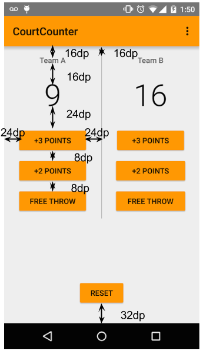

# Making An App Interactive
1. Look at the <a href="https://s3.amazonaws.com/video.udacity-data.com/topher/2017/July/595ab9de_common-android-views-cheat-sheet/common-android-views-cheat-sheet.pdf">Common Views cheat sheet</a>
1. <a href="https://www.jetbrains.com/help/idea/reformat-and-rearrange-code.html">How to reformat source code</a>  *code> reformat code* -> selected text **to reformat the code: fix the spacing and tabs.**
2. <a href="https://www.jetbrains.com/help/idea/reformat-and-rearrange-code.html">How to rearrange source code</a> *code>rearrange code*-> selected text **order the attribute according to the android studio guidelines.**
3. <a href="https://developer.android.com/studio/intro?utm_source=udacity&utm_medium=course&utm_campaign=android_basics#key-commands">Helpful keyboard shortcuts</a> for Android Studio
4. <code>android: textAllCaps="true"</code> use this attribute to capitalize your text, it is flexible way to change text format accord to need.
5. **For Windows, go to File > Settings > Editor > General > Auto Import** : To enable auto complete.
6. DDMS stands for Dalvik Debug Monitor Server, and is a tool in Android to help you debug your app.**(eclipse MAT support DDMS)(deprecated for  android studio)(used to find Memory Leaks, crashes etc).**
7. <a href="https://developer.android.com/studio/debug?utm_source=udacity&utm_medium=course&utm_campaign=android_basics">Debugging your code in Android Studio :</a> **add breakpoint to debug app.** *(just like dry run)*
8. **Project : just java, Screenshot of desired layout.**
    * **ViewGroup: LinearLayout -> orientation: vertical**  
        * TextView
        * **LinearLayout -> orientation: horizontal**
          * Button, TextView, Button.
        * TextView 
        * TextView
        * Button


      


## Project code : https://github.com/udacity/Just-Java

# Practice set 2 : Court Counter app 
1. `android: gravity=` **align view inside view's boundary like center horizonal, vertical horizonal, center etc.**
2. <code>android: layout_gravity=</code> **align view inside layout's boundary like center horizonal, vertical horizonal, center etc**
3. res>values>style.xml or theme res<br>
   
```xml

   <item name="colorPrimary">@color/orange</item>                    // used to set title bar background color.
   <item name="colorPrimaryDark">@color/orange</item>"</code>        //used to set top bar background color.
```
  
4. `getSupportActionBar().setTitle(Html.fromHtml("<fontcolor=\"black\">"+ getString(R.string.app_name)+"</font>"));`  used to change title bar text color.
5. **Project : Court Counter, Screenshot of desired layout.**
    * **ViewGroup: RelativeLayout**    
      * **LinearLayout -> orientation: horizontal**
        * **LinearLayout -> orientation: vertical**
            * TextView,TextView, Button :onClick, Button :onClick, Button :onClick.
        * `<View layout_width="1dp" layout_height="match_parent"/>`
        * **LinearLayout -> orientation: vertical**
            * TextView,TextView, Button :onClick, Button :onClick, Button :onClick.
      *  Button :onClick

 ### Screenshots of app
 
  
## Project Code: https://github.com/udacity/Court-Counter

# OOPS PART 1
1.Here are some helpful links:
   * <a href="https://developer.android.com/guide/topics/resources/providing-resources?utm_source=udacity&utm_medium=course&utm_campaign=android_basics">Resources Overview</a>
   * <a href="https://developer.android.com/guide/topics/resources/providing-resources?utm_source=udacity&utm_medium=course&utm_campaign=android_basics#Accessing">Accessing Resources</a>
   * <a href="https://developer.android.com/guide/practices/screens_support.html?utm_source=udacity&utm_medium=course&utm_campaign=android_basics">How to Support Multiple Screens</a>
   * <a href="https://developer.android.com/guide/topics/resources/providing-resources.html?utm_source=udacity&utm_medium=course&utm_campaign=android_basics">Providing Resources</a>
2. Access Resources
   * In java, : `R.<resource_type>.<resource_name>`
   * In xml, : `@<resource_type>/<resource_name>`
3. Parsing layout.xml file
   * Creates a Hierarchy of java objects
   * Inflates the objects like LinearLayout, TextView etc to form a view hierarchy.
   * Objects have various method to interact with these objects.


4. To see Classes code enable extension : **Chrome web store >> search >> Android SDK Search** : https://chrome.google.com/webstore/detail/android-sdk-search/elihjfnjglabmkeonphlglkpjppchoco?hl=en-US
