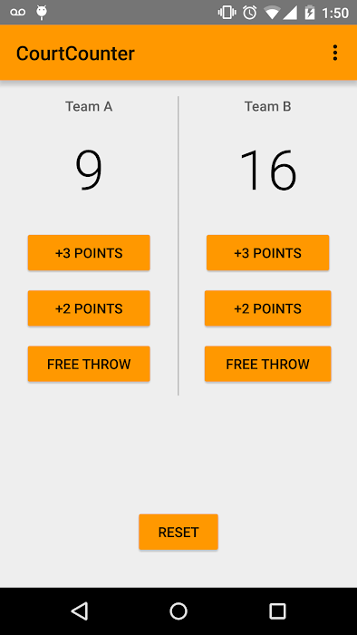

# Making An App Interactive
1. Look at the <a href="https://s3.amazonaws.com/video.udacity-data.com/topher/2017/July/595ab9de_common-android-views-cheat-sheet/common-android-views-cheat-sheet.pdf">Common Views cheat sheet</a>
1. <a href="https://www.jetbrains.com/help/idea/reformat-and-rearrange-code.html">How to reformat source code</a>  *code> reformat code* -> selected text **to reformat the code: fix the spacing and tabs.**
2. <a href="https://www.jetbrains.com/help/idea/reformat-and-rearrange-code.html">How to rearrange source code</a> *code>rearrange code*-> selected text **order the attribute according to the android studio guidelines.**
3. <a href="https://developer.android.com/studio/intro?utm_source=udacity&utm_medium=course&utm_campaign=android_basics#key-commands">Helpful keyboard shortcuts</a> for Android Studio
4. <code>android: textAllCaps="true"</code> use this attribute to capitalize your text, it is flexible way to change text format accord to need.
5. **For Windows, go to File > Settings > Editor > General > Auto Import** : To enable auto complete.
6. DDMS stands for Dalvik Debug Monitor Server, and is a tool in Android to help you debug your app.**(eclipse MAT support DDMS)(deprecated for  android studio)(used to find Memory Leaks, crashes etc).**
7. <a href="https://developer.android.com/studio/debug?utm_source=udacity&utm_medium=course&utm_campaign=android_basics">Debugging your code in Android Studio :</a> **add breakpoint to debug app.** *(just like dry run)*
8. **Project : just java, Screenshot of desired layout.**
    * **ViewGroup: LinearLayout -> orientation: vertical**  
        * TextView
        * **LinearLayout -> orientation: horizontal**
          * Button, TextView, Button.
        * TextView 
        * TextView
        * Button


      


## Project code : https://github.com/udacity/Just-Java

# Practice set 2 : Court Counter app 
1. `android: gravity=` **align view inside view's boundary like center horizonal, vertical horizonal, center etc.**
2. <code>android: layout_gravity=</code> **align view inside layout's boundary like center horizonal, vertical horizonal, center etc**
3. res>values>style.xml or theme res<br>
   
```xml

   <item name="colorPrimary">@color/orange</item>                    // used to set title bar background color.
   <item name="colorPrimaryDark">@color/orange</item>"</code>        //used to set top bar background color.
```
  
4. `getSupportActionBar().setTitle(Html.fromHtml("<fontcolor=\"black\">"+ getString(R.string.app_name)+"</font>"));`  used to change title bar text color.
5. **Project : Court Counter, Screenshot of desired layout.**
    * **ViewGroup: RelativeLayout**    
      * **LinearLayout -> orientation: horizontal**
        * **LinearLayout -> orientation: vertical**
            * TextView,TextView, Button :onClick, Button :onClick, Button :onClick.
        * `<View layout_width="1dp" layout_height="match_parent"/>`
        * **LinearLayout -> orientation: vertical**
            * TextView,TextView, Button :onClick, Button :onClick, Button :onClick.
      *  Button :onClick

 ### Screenshots of app
 
  
## Project Code: https://github.com/udacity/Court-Counter

# OOPS PART 1
1.Here are some helpful links:
   * <a href="https://developer.android.com/guide/topics/resources/providing-resources?utm_source=udacity&utm_medium=course&utm_campaign=android_basics">Resources Overview</a>
   * <a href="https://developer.android.com/guide/topics/resources/providing-resources?utm_source=udacity&utm_medium=course&utm_campaign=android_basics#Accessing">Accessing Resources</a>
   * <a href="https://developer.android.com/guide/practices/screens_support.html?utm_source=udacity&utm_medium=course&utm_campaign=android_basics">How to Support Multiple Screens</a>
   * <a href="https://developer.android.com/guide/topics/resources/providing-resources.html?utm_source=udacity&utm_medium=course&utm_campaign=android_basics">Providing Resources</a>
2. Access Resources
   * In java, : `R.<resource_type>.<resource_name>`
   * In xml, : `@<resource_type>/<resource_name>`
3. Parsing layout.xml file
   * Creates a Hierarchy of java objects
   * Inflates the objects like LinearLayout, TextView etc to form a view hierarchy.
   * Objects have various method to interact with these objects.


4. To see Classes code enable extension : **Chrome web store >> search >> Android SDK Search** : https://chrome.google.com/webstore/detail/android-sdk-search/elihjfnjglabmkeonphlglkpjppchoco?hl=en-US
5. ```java 
   public T findViewById (int id)  //returns view object
   ```
6. Red Lines are detailed specification of a design like spacing, padding etc.


# OOPS PART 2
1. ```xml
    //use Checkbox.isChecked() to know the state of the checkbox.
     <CheckBox
         android:id="@+id/notify_me_checkbox"
         android:layout_width="wrap_content"
         android:layout_height="wrap_content"
         android:text="@string/notify_me"
         android:textAppearance="?android:textAppearanceMedium" />
    ```
 2. **EDIT >> Indent Selection** :~ to indent selected text.
 3. ```xml
          <ScrollView   
               android:layout_width="match_parent"  
               android:layout_height="wrap_content"  
               android:id="@+id/scrollView">
               // Layout and views........
          </ScrollView>
          
           <HorizontalScrollView  
            android:layout_width="match_parent"  
            android:layout_height="60dp"  
            android:id="@+id/horizontalScrollView"> 
                // Layout and views........
            </HorizontalScrollView> 
            
     ```
  4. ```xml
      <EditText
         android:id="@+id/album_description_view"
         android:layout_width="match_parent"
         android:layout_height="wrap_content"
         android:hint="Name"                              // set hint for user 
         android:inputType="text" />                     // allows only Characters
      ```
   5. `public Editable getText ()` 
   6. How to set emoji by unicode in a textview?
      ```java
             // replaced 'U+' by '0x'
             // Example: replace 'U+1F60A' by '0x1F60A'
             int unicode = 0x1F60A;
             String emoji = getEmojiByUnicode(unicode)
             String text = "So happy "
             textview.setText(text + emoji);
            ...
            public String getEmojiByUnicode(int unicode){
                 return new String(Character.toChars(unicode));
             }
         
             ...
            output: So happy 😊
      ```
   7. Intent : Intent as a message specifying some operation to be performed
         * Action, Data, Category, Component, Extras.
   
  8. <a href="https://developer.android.com/guide/components/intents-common.html?utm_source=udacity&utm_medium=course&utm_campaign=android_basics">Common Intents Guide</a>
  9. Compose mail
  ```java
      Intent intent = new Intent(Intent.ACTION_SEND);
      intent.setType("*/*");
      intent.putExtra(Intent.EXTRA_SUBJECT, "just java order for "+ name);
      intent.putExtra(Intent.EXTRA_TEXT, orderSummary);
      if (intent.resolveActivity(getPackageManager()) != null) { // check for apps that support ACTION_SEND intent
           startActivity(intent);
      }
  ```
  
  10. **Localization** : See this <a href="https://developer.android.com/distribute/best-practices/launch/localization-checklist?utm_source=udacity&utm_medium=course&utm_campaign=android_basics#manage-strings">article</a> for an in-depth explanation of how to manage strings.
      * Step 1: Avoid using hardcoded string, use @string/xyz
      * Step 2: style.xml
                  * style.xml //english
                  * style.xml(es) //spanish 
  ```xml
<?xml version="1.0" encoding="utf-8"?>
<resources xmlns:xliff="urn:oasis:names:tc:xliff:document:1.2">
    <!-- Title for the application. [CHAR LIMIT=12] -->
    <string name="app_name">Sólo Java</string>

    <!-- Hint text display in the empty field for the user's name [CHAR LIMIT=20] -->
    <string name="name">Nombre</string>

    <!-- Hint text display in the empty field for the user's name [CHAR LIMIT=20] -->
    <string name="toppings">Ingredientes</string>

    <!-- Hint text display in the empty field for the user's name [CHAR LIMIT=20] -->
    <string name="whipped_cream">Crema batida</string>

    <!-- Hint text display in the empty field for the user's name [CHAR LIMIT=20] -->
    <string name="chocolate">Chocolate</string>

    <!-- Hint text display in the empty field for the user's name [CHAR LIMIT=20] -->
    <string name="quantity">Cantidad</string>

    <!-- Hint text display in the empty field for the user's name [CHAR LIMIT=5] -->
    <string name="initial_quantity_value">2</string>

    <!-- Hint text display in the empty field for the user's name [CHAR LIMIT=20] -->
    <string name="order">Ordenar</string>

    <!--
      Name for the order summary. It will be shown in the format of "Name: Amy" where Amy is the
      user's name. [CHAR LIMIT=NONE]
    -->
    <string name="order_summary_name">Nombre: <xliff:g id="name" example="Amy">%s</xliff:g></string>

    <!--
      Whipped cream topping for the order summary. It will be shown in the format of
      "Add whipped cream? true" or "Add whipped cream? false". [CHAR LIMIT=NONE]
    -->
    <string name="order_summary_whipped_cream">Agregue la crema batida? <xliff:g id="addWhippedCream" example="true">%b</xliff:g></string>

    <!--
      Chocolate topping for the order summary. It will be shown in the format of
      "Add chocolate? true" or "Add chocolate? false". [CHAR LIMIT=NONE]
    -->
    <string name="order_summary_chocolate">Agregue el chocolate? <xliff:g id="addChocolate" example="true">%b</xliff:g></string>

    <!--
      Quantity of coffee cups for the order summary. It will be shown in the format of
      "Quantity: 2", where 2 is the number of cups ordered. [CHAR LIMIT=NONE]
    -->
    <string name="order_summary_quantity">Cantidad: <xliff:g id="quantity" example="2">%d</xliff:g></string>

    <!--
      Total price for the order summary. It will be shown in the format of
      "Total: $10" where $10 is the price. [CHAR LIMIT=NONE]
    -->
    <string name="order_summary_price">Total: <xliff:g id="price" example="$10">%s</xliff:g></string>

    <!-- Thank you message for the order summary. [CHAR LIMIT=NONE] -->
    <string name="thank_you">¡Gracias!</string>

    <!--
      Subject line for the order summary email. It will be in the format of
      "Just Java order for Amy" where Amy is the user's name. [CHAR LIMIT=NONE]
    -->
    <string name="order_summary_email_subject">Sólo java para <xliff:g id="name" example="Amy">%s</xliff:g></string>
</resources>
```
11. addition resources : https://classroom.udacity.com/courses/ud836/lessons/4584545214/concepts/a573bb40-2b12-437a-969f-185a45a3af2b


## Project code : https://github.com/udacity/Just-Java
  
