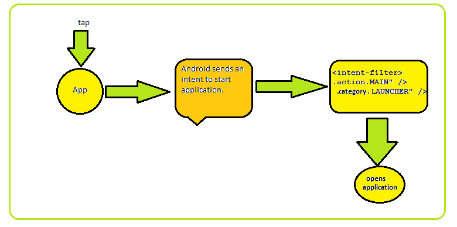
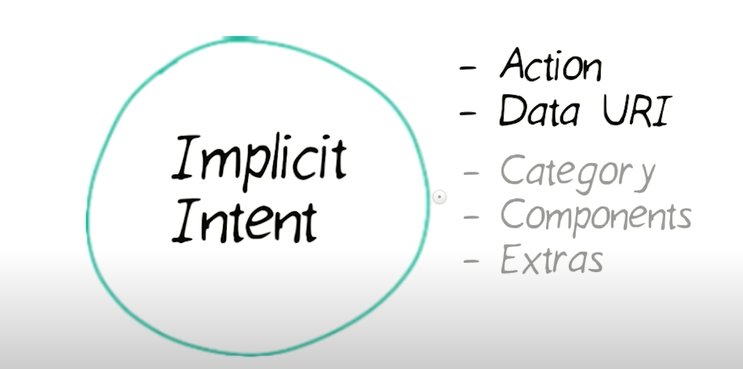
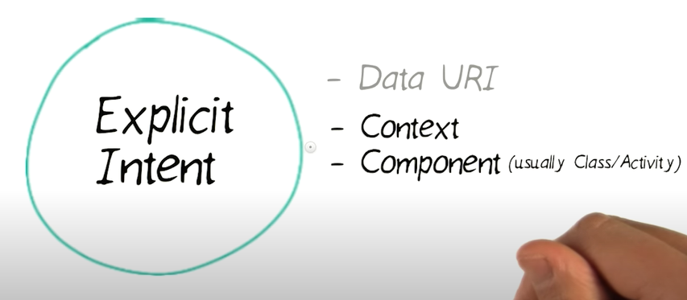
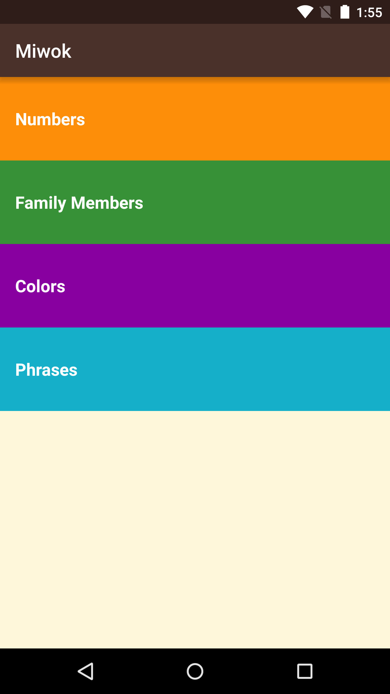

# Android Basics: Multiscreen Apps
1. **color: https://material.io/resources/color/#!/?view.left=0&view.right=0**
2. When user tap on the app icon, android sends an intent to start your application, then that intent is handled by main activity and opens app's launcher screen.


## Intent
1. blog : https://www.vogella.com/tutorials/AndroidIntent/article.html#usingintents_call
2. Intents are asynchronous messages which allows you to interact with components from the same applications as well as with components contributed by other applications. For example, an activity can start an external activity for taking a picture.
3. Types of intent :
    * Implicit intent : An implicit intent specifies an action that can invoke any app on the device able to perform the action. Using an implicit intent is useful when your app cannot perform the action, but other apps probably can and you'd like the user to pick which app to use.
    ```java
         Intent i = new Intent();
         i.setAction(Intent.ACTION_VIEW);
         i.setData(Uri.parse("www.tutorialspoint.com"));
         try{
               startActivity(i);
           }
          catch(Exception e)
          {   
                //error
          }
   ```
   
   
   * It going to connect the internal world of an application such as start activity or send data between two activities. To start new activity we have to create Intent object 
     and pass source activity and destination activity as shown below-
     ```java
         Intent send = new Intent(MainActivity.this, SecondActivity.class);
         startActivity(send);
     ```
    

### creating Miwok application 


