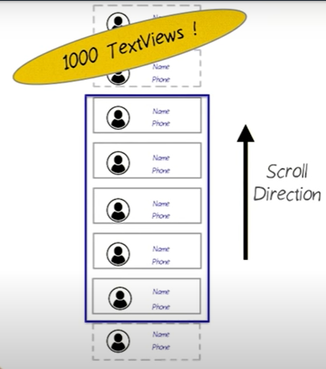
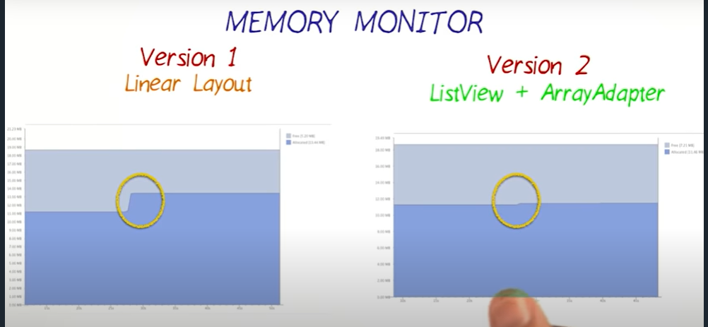
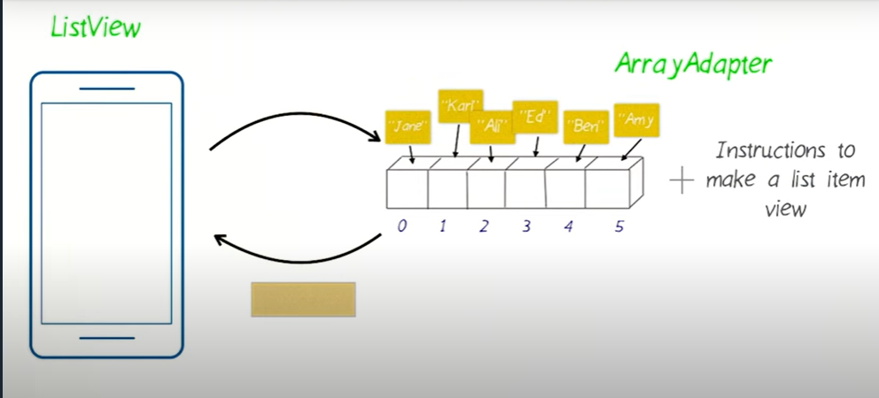
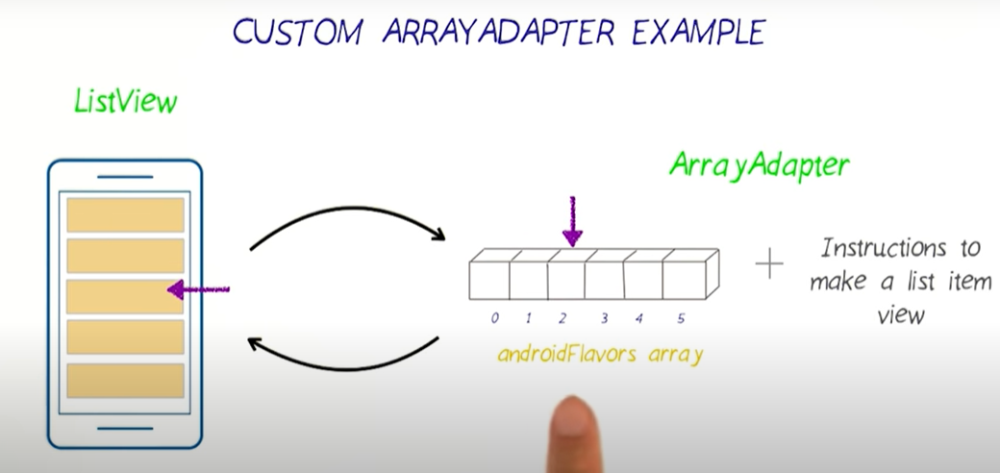

# Android Basics: Multiscreen Apps
## Chapter 1
1. **color: https://material.io/resources/color/#!/?view.left=0&view.right=0**
2. When user tap on the app icon, android sends an intent to start your application, then that intent is handled by main activity and opens app's launcher screen.


## Intent
1. blog : https://www.vogella.com/tutorials/AndroidIntent/article.html#usingintents_call
2. Intents are asynchronous messages which allows you to interact with components from the same applications as well as with components contributed by other applications. For example, an activity can start an external activity for taking a picture.
3. Types of intent :
    * Implicit intent : An implicit intent specifies an action that can invoke any app on the device able to perform the action. Using an implicit intent is useful when your app cannot perform the action, but other apps probably can and you'd like the user to pick which app to use.
    
    ```java
    
        //setData() - This method is only to specifies a URI.
        //setType()- This method specifies a MIME type.
        //setDataAndType()- This method i specifies both a URI and a MIME type.
        
         Intent i = new Intent();
         i.setAction(Intent.ACTION_VIEW);
         i.setData(Uri.parse("www.tutorialspoint.com"));
         
         //verify that intent will resolve properly
         if(i.resolveActivity(getPackageManager())!=null){
               startActivity(i);
         }
           

   ```
   <br>
   
   <br>
   * It going to connect the internal world of an application such as start activity or send data between two activities. To start new activity we have to create Intent object 
     and pass source activity and destination activity as shown below-
     
     ```java
         Intent send = new Intent(MainActivity.this, SecondActivity.class);
         startActivity(send);
     ```
     <br>
    
   <br>

### To change Activity title bar text

```xml
 AndroidManifest.xml
<application>
   ...
    <activity
            android:name=".PhrasesActivity"
            android:label="@string/phrases"  //string displayed to user
            android:exported="true" />
   ...
                  
 </application>
```


## Event listeners
An event listener is an interface in the View class that contains a single callback method. These methods will be called by the Android framework when the View to which the listener has been registered is triggered by user interaction with the item in the UI.<br>
1. steps:
     * hardware detects the touch
     * informs View about the event.
     * performs callback method of registered listeners. 


```java
public class MainActivity extends AppCompatActivity {

    @Override
    protected void onCreate(Bundle savedInstanceState) {
        super.onCreate(savedInstanceState);
        setContentView(R.layout.activity_main);
        TextView numbers=findViewById(R.id.numbers);
        TextView colors=findViewById(R.id.colors);
        TextView familyMember=findViewById(R.id.family_members);
        TextView phrases=findViewById(R.id.phrases);
        
        // listener objects

        NumbersOnClickListener numbersOnClickListener=new NumbersOnClickListener();
        ColorsOnClickListener colorsOnClickListener=new ColorsOnClickListener();
        FamilyMembersOnClickListener familyMembersOnClickListener=new FamilyMembersOnClickListener();
        PhrasesOnClickListener phrasesOnClickListener=new PhrasesOnClickListener();

       //registering listener objects to View
        numbers.setOnClickListener(numbersOnClickListener);
        colors.setOnClickListener(colorsOnClickListener);
        familyMember.setOnClickListener(familyMembersOnClickListener);
        phrases.setOnClickListener(phrasesOnClickListener);
    }

    public class NumbersOnClickListener implements View.OnClickListener
    {
        @Override
        public void onClick(View v) {
            Intent intent=NumbersActivity.makeNumbersActivityIntent(MainActivity.this); // factory method
            startActivity(intent);
        }
    }

    public class ColorsOnClickListener implements View.OnClickListener
    {
        @Override
        public void onClick(View v) {
            Intent intent=ColorsActivity.makeColorsActivityIntent(MainActivity.this); // factory method
            startActivity(intent);
        }
    }

    public class FamilyMembersOnClickListener implements View.OnClickListener
    {
        @Override
        public void onClick(View v) {
            Intent intent=FamilyMembersActivity.makeFamilyMembersActivityIntent(MainActivity.this); // factory method
            startActivity(intent);
        }
    }

    public class PhrasesOnClickListener implements View.OnClickListener
    {
        @Override
        public void onClick(View v) {
            Intent intent=PhrasesActivity.makePhrasesActivityIntent(MainActivity.this); // factory method
            startActivity(intent);
        }
    }
}
```
### or, short way to write above code 

```java
 protected void onCreate(Bundle savedInstanceState) {
        super.onCreate(savedInstanceState);
        setContentView(R.layout.activity_main);
        TextView numbers=findViewById(R.id.numbers);
        TextView colors=findViewById(R.id.colors);
        TextView familyMember=findViewById(R.id.family_members);
        TextView phrases=findViewById(R.id.phrases);
        

        numbers.setOnClickListener(new View.OnClickListener() {
            @Override
            public void onClick(View v) {
                Intent intent=NumbersActivity.makeNumbersActivityIntent(MainActivity.this);
                startActivity(intent);
            }
        });
        colors.setOnClickListener(new View.OnClickListener() {
            @Override
            public void onClick(View v) {

                Intent intent=ColorsActivity.makeColorsActivityIntent(MainActivity.this);
                startActivity(intent);

            }
        });
        familyMember.setOnClickListener(new View.OnClickListener() {
            @Override
            public void onClick(View v) {
                Intent intent=FamilyMembersActivity.makeFamilyMembersActivityIntent(MainActivity.this);
                startActivity(intent);

            }
        });
        phrases.setOnClickListener(new View.OnClickListener() {
            @Override
            public void onClick(View v) {
                Intent intent=PhrasesActivity.makePhrasesActivityIntent(MainActivity.this);
                startActivity(intent);

            }
        });
    }
  ```
  
  
## OnClickListener vs onClick
When you define a listener using the onClick attribute, the view looks for a method with that name only in its host activity. Programmatically setting an OnClickListener allows you to control a button's behavior from somewhere other than its host activity. This will become very relevant when we learn about Fragments, which are basically mini activities, allowing you to build reusable collections of views with their own lifecycle, which can then be assembled into activities. Fragments always need to use OnClickListeners to control their buttons, since they're not Activities, and won't be searched for listeners defined in onClick.

### creating Miwok application 


## Chapter 2:
1. Adding TextView to LinearLayout dynamically.
```java
        ArrayList<String> words=new ArrayList<>();
        words.add("One");
        words.add("Two");
        words.add("Three");
        words.add("Four");
        words.add("Five");
        words.add("Six");
        words.add("Seven");
        words.add("Eight");
        words.add("Nine");
        words.add("Ten");


        LinearLayout rootView=findViewById(R.id.root_view);
        for(int i=0;i<10;i++) {
            TextView wordView = new TextView(this);
            wordView.setText(words.get(i));
            rootView.addView(wordView);
        }
```

### Memory is a limited resource
1.  Memory is limited, if we are working with huge data, so creating views for enitre data at once cause Memory problem.
2.  To Use the Memory efficiently, we use view recycling, in which app display certain part of data to the user and reuse the views when user scrolls up and down.
<br>
  
 
 
#### ListView+ArrayAdapter

<br>

1. Android ListView is a view which contains the group of items and displays in a scrollable list. ListView is implemented by importing android.widget.ListView class.
2. ListView uses Adapter classes which add the content from data source (such as string array, array, database etc) to ListView.
```xml
   <ListView xmlns:android="http://schemas.android.com/apk/res/android"
    xmlns:app="http://schemas.android.com/apk/res-auto"
    xmlns:tools="http://schemas.android.com/tools"
    android:layout_width="match_parent"
    android:layout_height="match_parent"
    android:id="@+id/root_view"
    android:orientation="vertical"
    tools:context=".NumbersActivity">

   </ListView>
```
```java
        ArrayList<String> words=new ArrayList<>(); //data
        words.add("One");
        words.add("Two");
        words.add("Three");
        words.add("Four");
        words.add("Five");
        words.add("Six");
        words.add("Seven");
        words.add("Eight");
        words.add("Nine");
        words.add("Ten");
        
        ArrayAdapter<String> item=new ArrayAdapter<>(this,android.R.layout.simple_list_item_1, words); //Adapter
        ListView listView=findViewById(R.id.root_view);
        listView.setAdapter(item);
```


## DesignTime layout attribute
**Android Studio supports a variety of XML attributes in the tools namespace that enable design-time features (such as which layout to show in a fragment) or compile-time behaviors (such as which shrinking mode to apply to your XML resources). When you build your app, the build tools remove these attributes so there is no effect on your APK size or runtime behavior.**

```xml
//custom layout R,layout.list_view

<LinearLayout xmlns:android="http://schemas.android.com/apk/res/android"
    xmlns:tools="http://schemas.android.com/tools"
    android:layout_width="wrap_content"
    android:layout_height="wrap_content"
    android:paddingTop="16dp"
    android:paddingLeft="16dp"
    android:orientation="vertical"
    >
    <TextView
        android:layout_width="wrap_content"
        android:layout_height="match_parent"
        android:id="@+id/miwok_word"
        tools:text="Miwok"              //This text shown during design time, but won't display on runtime.
        />
        
    <TextView
        android:layout_width="wrap_content"
        android:layout_height="match_parent"
        android:id="@+id/default_word"
        tools:text="one"
       />
 </LinearLayout>
 ```
 
## Custom Adapter for ListView

1. To create CustomAdapter, you have to override getView() method. 
2. ListView calls getView() to get views.



```java
//word class for data

public class Word {

    private String mDefaultTranslation;
    private String mMiwokTranslation;

    public Word(String defaultTranslation,String miwokTranslation)
    {
        mDefaultTranslation=defaultTranslation;
        mMiwokTranslation=miwokTranslation;
    }

    public String getmDefaultTranslation()
    {
        return mDefaultTranslation;
    }

    public String getmMiwokTranslation() {
        return mMiwokTranslation;
    }
}
```

```java
// Adapter class to convert Words ArrayList to ArrayAdapter.

public class WordAdapter extends ArrayAdapter<Word> {


    public WordAdapter(Context context, ArrayList<Word> words)
    {
        super(context,0,words);

    }

    @NonNull
    @Override
    public View getView(int position, @Nullable View convertView, @NonNull ViewGroup parent) {  // override getView method for custom Adapter
        Word word=getItem(position);  // get Data At position.

        // to reuse view
        View listView=convertView;
        //sometimes it is null, so we have to create new one
        if(listView==null)
        {
            listView= LayoutInflater.from(getContext()).inflate(R.layout.list_view,parent,false); // create new View
        }

        TextView miwok=listView.findViewById(R.id.miwok_word); 
        TextView deft=listView.findViewById(R.id.default_word);
        miwok.setText(word.getmMiwokTranslation());
        deft.setText(word.getmDefaultTranslation());
        return listView;
    }
}

```

```java
//NumberActivity
      ....
        WordAdapter item=new WordAdapter(this, words);
        ListView listView=findViewById(R.id.root_view);
         listView.setAdapter(item);
        ....
```
       

 


