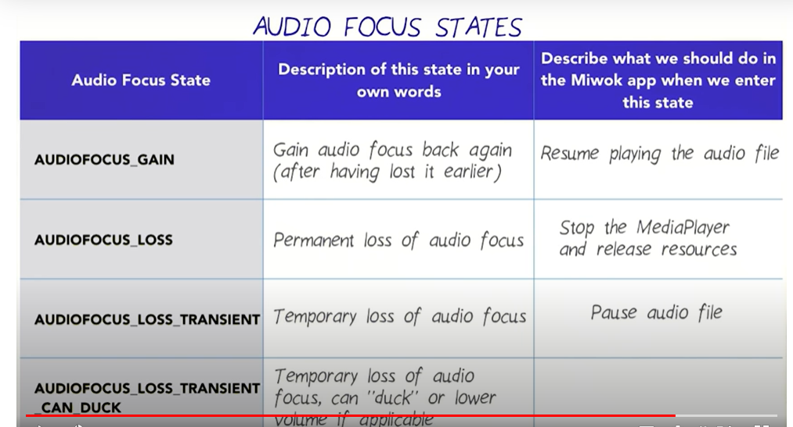

# Polishing Views
1.  
```xml
<LinearLayout xmlns:android="http://schemas.android.com/apk/res/android"
    xmlns:tools="http://schemas.android.com/tools"
    android:layout_width="match_parent"
    android:layout_height="wrap_content"-----> otherwise, wrap the content
    android:orientation="horizontal"
    android:minHeight="88dp"----------------> min height

    >
```
2. View.setVisibility(View.VISIBLE | View.Invisible | View.GONE);
      * `View.VISIBLE` :  view is visible to user.
      * `View.INVISIBLE`: view is invisible to the user but using space of the view.
      * `View.GONE` : view is completely gone, invisible + using no space.
3. values/dimens.xml to set dimens just like colors, strings.


# Activity LifeCycle and Audio playback


1. ListView provides a single ItemClickListener to process onClick action on views.
    * One way to process onClick is by creating listener for each views (but, if there are ~1000000 rows then this is not an efficient solution). 

```java

            listView.setOnItemClickListener(new AdapterView.OnItemClickListener() {       // Asynchronous callback

            //AdapterView -> AdapterView where the click happens
            // View--> The view within the AdapterView that was clicked
            // position --> position of data within Adapterview data source
            // id --> row id of item that was clicked. 
            @Override
            public void onItemClick(AdapterView<?> parent, View view, int position, long id) {
                    stop(); // also call before creating new mediaplayer, sometimes user switches bw different
                            // audios before their completion.

                    mMediaPlayer= MediaPlayer.create(FamilyMembersActivity.this,words.get(position).getmAudioMedia());
                
                    mMediaPlayer.setOnCompletionListener(new MediaPlayer.OnCompletionListener() {      // Asynchronous callback
                                 @Override
                                public void onCompletion(MediaPlayer mp) {
                                             stop();
                                }
                    });
                
                    mMediaPlayer.start(); //no need to call prepare(); create does that for you
            }
        });
    ....
    
    public void stop() {
        if (mMediaPlayer != null) {

            mMediaPlayer.release(); // release the resource
            mMediaPlayer = null;   
        }
    }
}

```


## Note: use a keyboard shortcut to automatically “Generate a method (Getters, Setters, Constructors, toString, etc..)”. On Windows, the keyboard shortcut is ALT + Insert.
## Cntrl+ O to get all the override methods

# Activity Lifecycle
<p align="center">

</p>

### 1.onCreate()
Application created and intialization stage.

### 2.onStart()
Application becoming Visible.

### 3.onResume()
Application ready for interaction.

### 4.onPause()
Application is visible but unfocused.

### 5.onStop()
Application not longer visible.
```java
    @Override
    protected void onStop() {
        super.onStop();
        stop();
    }
    
    public void stop() {
        if (mMediaPlayer != null) {

            mMediaPlayer.release(); // release the resource
            mMediaPlayer = null;    // set it to null to avoid memory leak
        }
    }
```

### 6.onRestart()
Application comes to foreground after being stopped.

### 7.onDestory()
Application destoryed and all allocated resources are freed.


# Audio Focus
1. blog : https://medium.com/google-developers/how-to-properly-handle-audio-interruptions-3a13540d18fa#.jkibca8ml

2. AudioManager class in Android framework allows us:
            * Request Audio Focus.
            * Abandon Audio Focus.
            * Registered a listener to notified of Audio focus state change.

### Audio focus is a concept introduced in API 8. It is used to convey the fact that a user can only focus on a single audio stream at a time, e.g. listening to music or a podcast, but not both at the same time. In some cases, multiple audio streams can be playing at the same time, but there is only one the user would really listen to (focus on), while the other plays in the background. An example of this is driving directions being spoken while music plays at a reduced volume (a.k.a. ducking).
<p align="center">

</p>


```java
//GLOBAL VARIABLES

 private AudioManager  mAudioManager;


    private AudioManager.OnAudioFocusChangeListener onAudioFocusChangeListener= new AudioManager.OnAudioFocusChangeListener() {
        @Override
        public void onAudioFocusChange(int focusChange) {
            if (focusChange == AudioManager.AUDIOFOCUS_LOSS_TRANSIENT || 
                   focusChange == AudioManager.AUDIOFOCUS_LOSS_TRANSIENT_CAN_DUCK) {  // loss focus
                mMediaPlayer.pause(); // pause audio
                mMediaPlayer.seekTo(0);//reset to beginning
            } 
            else if (focusChange == AudioManager.AUDIOFOCUS_GAIN) {     // regain focus
                mMediaPlayer.start();
            } 
            else if (focusChange == AudioManager.AUDIOFOCUS_LOSS) {   // compeletely lost focus 
                stop();
            }
        }

    };


.....
 mAudioManager= (AudioManager) getSystemService(AUDIO_SERVICE)
listView.setOnItemClickListener(new AdapterView.OnItemClickListener() {
            @Override
            public void onItemClick(AdapterView<?> parent, View view, int position, long id) {
                stop();


                int requestAudioFocus;
                
                if (android.os.Build.VERSION.SDK_INT >= android.os.Build.VERSION_CODES.O) {
                    AudioAttributes mPlaybackAttributes= new AudioAttributes.Builder()     //creating Audio Attributes
                            .setLegacyStreamType(AudioManager.STREAM_MUSIC)
                            .build();
                            
                            
                    AudioFocusRequest  mAudioFocus=new AudioFocusRequest.Builder(AudioManager.AUDIOFOCUS_GAIN_TRANSIENT) // creating audio focus 
                            .setAudioAttributes(mPlaybackAttributes)
                            .setOnAudioFocusChangeListener(onAudioFocusChangeListener)
                            .build();
                            
                    requestAudioFocus=mAudioManager.requestAudioFocus(mAudioFocus);                       //Requesting audio focus
                }
                else {
                   requestAudioFocus= mAudioManager.requestAudioFocus(onAudioFocusChangeListener,
                            AudioManager.STREAM_MUSIC, AudioManager.AUDIOFOCUS_GAIN_TRANSIENT);            //Requesting audio focus (old way of requesting audio focus)
                }
                
                
                
              if(requestAudioFocus==AudioManager.AUDIOFOCUS_REQUEST_GRANTED) {    // if GRANTED
                  mMediaPlayer = MediaPlayer.create(NumbersActivity.this, words.get(position).getmAudioMedia());
                  mMediaPlayer.setOnCompletionListener(onCompletionListener);
                  mMediaPlayer.start();
              }
              else
                  Toast.makeText(NumbersActivity.this,
                          "failed focus request",
                          Toast.LENGTH_LONG).show();
                          
                          
           }
        });
    }
    
    ...
    
     public void stop() {
        if (mMediaPlayer != null) {

            mMediaPlayer.release();
            mMediaPlayer = null;
            mAudioManager.abandonAudioFocus(onAudioFocusChangeListener);
        }
    }
                          
                          
```


