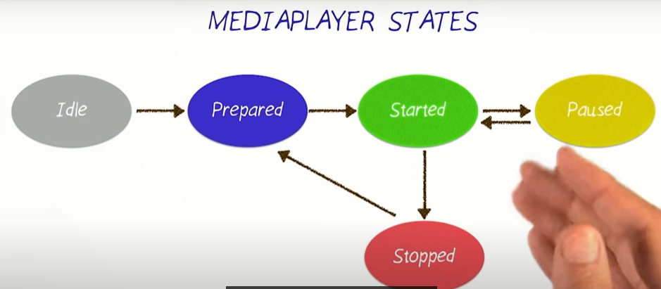

# Polishing Views
1.  
```xml
<LinearLayout xmlns:android="http://schemas.android.com/apk/res/android"
    xmlns:tools="http://schemas.android.com/tools"
    android:layout_width="match_parent"
    android:layout_height="wrap_content"-----> otherwise, wrap the content
    android:orientation="horizontal"
    android:minHeight="88dp"----------------> min height

    >
```
2. View.setVisibility(View.VISIBLE | View.Invisible | View.GONE);
      * `View.VISIBLE` :  view is visible to user.
      * `View.INVISIBLE`: view is invisible to the user but using space of the view.
      * `View.GONE` : view is completely gone, invisible + using no space.
3. values/dimens.xml to set dimens just like colors, strings.


# Activity LifeCycle and Audio playback


1. ListView provides a single ItemClickListener to process onClick action on views.
    * One way to process onClick is by creating listener for each views (but, if there are ~1000000 rows then this is not an efficient solution). 

```java

            listView.setOnItemClickListener(new AdapterView.OnItemClickListener() {       // Asynchronous callback

            //AdapterView -> AdapterView where the click happens
            // View--> The view within the AdapterView that was clicked
            // position --> position of data within Adapterview data source
            // id --> row id of item that was clicked. 
            @Override
            public void onItemClick(AdapterView<?> parent, View view, int position, long id) {
                    stop(); // also call before creating new mediaplayer, sometimes user switches bw different
                            // audios before their completion.

                    mMediaPlayer= MediaPlayer.create(FamilyMembersActivity.this,words.get(position).getmAudioMedia());
                
                    mMediaPlayer.setOnCompletionListener(new MediaPlayer.OnCompletionListener() {      // Asynchronous callback
                                 @Override
                                public void onCompletion(MediaPlayer mp) {
                                             stop();
                                }
                    });
                
                    mMediaPlayer.start(); //no need to call prepare(); create does that for you
            }
        });
    ....
    
    public void stop() {
        if (mMediaPlayer != null) {

            mMediaPlayer.release(); // release the resource
            mMediaPlayer = null;    // set it tu null to avoid memory leak
        }
    }
}

```


## Note: use a keyboard shortcut to automatically “Generate a method (Getters, Setters, Constructors, toString, etc..)”. On Windows, the keyboard shortcut is ALT + Insert.
## Cntrl+ O to get all the override methods

# Activity Lifecycle
<p align="center">

</p>

## 1.onCreate()
Application created and intialization stage.

## 2.onStart()
Application becoming Visible.

## 3.onResume()
Application ready for interaction.

## 4.onPause()
Application is visible but unfocused.

## 5.onStop()
Application not longer visible.
```java
    @Override
    protected void onStop() {
        super.onStop();
        stop();
    }
    
    public void stop() {
        if (mMediaPlayer != null) {

            mMediaPlayer.release(); // release the resource
            mMediaPlayer = null;    // set it tu null to avoid memory leak
        }
    }
```

## 6.onRestart()
Application comes to foreground after being stopped.

## 7.onDestory()
Application destoryed and all allocated resources are freed.


# Audio Focus


