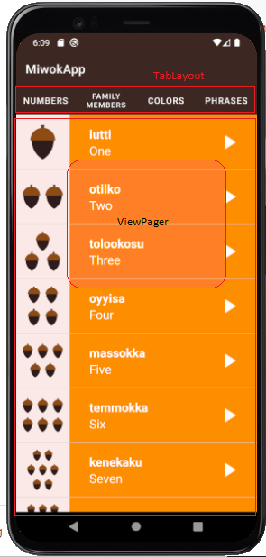

# Navigation Patterns in Android
1. **Navigation guides users between different parts of your app.**
      * **Simple Navigation** layout holding list of data. when you  click on the data ,a detailed data view of item appears.
      * **Navigation Drawer** layout holding list of data on side drawer, when you  click on the data ,a detailed data view of item appears.
      * **swipeable tabs** You can swipe horizontally left and right between different screens, or you can tap one of the tabs across the top of the screen. ex: youtube

2.  Designs example: 
      * http://androidniceties.tumblr.com/
      * https://pttrns.com/android-patterns?srtby=popularity_desc 

3. Add Up Button to your Activity
      * http://developer.android.com/training/implementing-navigation/ancestral.html
4. Additional Resources on Navigation:
      * http://developer.android.com/training/design-navigation/ancestral-temporal.html
      * http://developer.android.com/design/patterns/navigation.html

5.  **Refactor code : perform changes without breaking the existing functionalities.**
6.  **Regression  : meaning : developed to less developed state:** When you break something, and the user loses the ability to do something in the app 
    compared to earlier versions, this is called regression
7. TabLayout : https://material.io/components/tabs 


# Fragment 
**A fragment is just a part of an activity. You can have a fragment that takes up part of a screen or a whole screen. Or you can show multiple fragments at the 
same time to make up a whole screen. Within an activity, you can also swap out different fragments with each other.**
1. A Fragment is a Java class. You create your own Fragment, just like you created your own activities. You subclass the Fragment class in the Android framework.
2. The Fragment class is a class provided by the Android framework. The fragments we've create - NumbersFragment, ColorsFragment, etc - are subclasses that inherit from the Fragment super class.

<p align="center">
  
  
      
  </p>
  
  

# Fragment Lifecycle

<p align="center">
  
</p>

  ```java
  
  public class NumbersFragment extends Fragment{
      @Override
      public View onCreateView(LayoutInflater inflater, ViewGroup container,Bundle savedInstanceState) {
                    View rootView = inflater.inflate(R.layout.word_list, container, false);
                    /** TODO: Insert all the code from the NumberActivity’s onCreate() method after the setContentView method call */
                    return rootView;
      }
    }
  
  ```
  
  ```java
  //example
  public class NumbersActivity extends AppCompatActivity {

   @Override
   protected void onCreate(Bundle savedInstanceState) {
   super.onCreate(savedInstanceState);
   setContentView(R.layout.activity_category);
   getSupportFragmentManager().beginTransaction()
           .replace(R.id.container, new NumbersFragment())
           .commit();
   }
}

```


## Tabs and ViewPager
1. <a href="https://www.youtube.com/watch?v=zQekzaAgIlQ">Android Development Patterns</a> video on Tabs and ViewPage.
2. Sample ViewPager app  : https://github.com/udacity/ud839_ViewPager_Example/tree/quiz/app/src/main/java/com/example/android/viewpager
```java
// Fragment Example

public class NumbersFragment extends Fragment {
   
    private MediaPlayer mMediaPlayer;
    private AudioManager mAudioManager;


     .....

    @Nullable
    @Override
    public View onCreateView(@NonNull LayoutInflater inflater, @Nullable ViewGroup container, @Nullable Bundle savedInstanceState) {
        View rootView = inflater.inflate(R.layout.fragment_numbers, container, false);

       ......

        WordAdapter item = new WordAdapter(getContext(), words, R.color.orange);
        ListView listView = rootView.findViewById(R.id.numbers_root_view);
        listView.setAdapter(item);


        .....

        return rootView;
    }


    
}

```
## Pager Adapter
1. Base class providing the adapter to populate pages inside of a ViewPager. You will most likely want to use a more specific implementation of this, such as FragmentPagerAdapter or FragmentStatePagerAdapter.
2. **FragmentPagerAdapter :** Implementation of PagerAdapter that represents each page as a Fragment that is persistently kept in the fragment manager as long as the user can return to the page.
This version of the pager is best for use when there are a handful of typically more static fragments to be paged through, such as a set of tabs. The fragment of each page the user visits will be kept in memory, though its view hierarchy may be destroyed when not visible. This can result in using a significant amount of memory since fragment instances can hold on to an arbitrary amount of state. For larger sets of pages, consider FragmentStatePagerAdapter.
3. **FragmentStatePagerAdapter :** This version of the pager is more useful when there are a large number of pages, working more like a list view. When pages are not visible to the user, their entire fragment may be destroyed, only keeping the saved state of that fragment. This allows the pager to hold on to much less memory associated with each visited page as compared to FragmentPagerAdapter at the cost of potentially more overhead when switching between pages.
```java
public class MiwokFragmentPagerAdapter extends FragmentPagerAdapter {

    Context mContext;
    public MiwokFragmentPagerAdapter(Context context,@NonNull FragmentManager fm, int behavior) {
        super(fm, behavior);
        mContext=context;
    }

    @NonNull
    @Override
    public Fragment getItem(int position) {
        switch (position)
        {
            case 0:return new NumbersFragment();
            case 1:return new FamilyMembersFragment();
            case 2:return new ColorsFragment();
            default:return new PhrasesFragment();
        }

    }

    @Nullable
    @Override
    public CharSequence getPageTitle(int position) {
       switch (position)
       {
           case 0: return  mContext.getString(R.string.numbers);
           case 1: return  mContext.getString(R.string.family_Member);
           case 2: return  mContext.getString(R.string.colors);
           default: return  mContext.getString(R.string.phrases);
       }
    }

    @Override
    public int getCount() {
        return 4;
    }
}
```

# Main Activity

```java
//Main Activity
public class MainActivity extends AppCompatActivity {


    @Override
    protected void onCreate(Bundle savedInstanceState) {
        super.onCreate(savedInstanceState);
        setContentView(R.layout.activity_main);
        ViewPager viewPager=findViewById(R.id.parent_view_pager);
        MiwokFragmentPagerAdapter miwokFragmentPagerAdapter=new MiwokFragmentPagerAdapter(this,getSupportFragmentManager(),0);
        viewPager.setAdapter(miwokFragmentPagerAdapter);

        TabLayout tabs=findViewById(R.id.tabs);
        tabs.setupWithViewPager(viewPager);
    }


}
```
<p align="center">
     
</p>

```xml
<LinearLayout xmlns:android="http://schemas.android.com/apk/res/android"
    xmlns:app="http://schemas.android.com/apk/res-auto"
    xmlns:tools="http://schemas.android.com/tools"
    android:layout_width="match_parent"
    android:layout_height="match_parent"
    android:background="@color/deep_orange_primary"
    android:orientation="vertical"
    tools:context=".MainActivity">

    <com.google.android.material.tabs.TabLayout
        android:layout_width="match_parent"
        android:layout_height="wrap_content"
        android:background="@color/brown"
        app:tabTextColor="@color/white"
        android:id="@+id/tabs"
        >

        <com.google.android.material.tabs.TabItem
            android:layout_width="wrap_content"
            android:layout_height="wrap_content"
            android:minHeight="25dp"

            android:text="@string/numbers"
            />
        <com.google.android.material.tabs.TabItem
            android:layout_width="wrap_content"
            android:layout_height="wrap_content"
            android:minHeight="25dp"
            android:text="@string/family_Member"
            />
        <com.google.android.material.tabs.TabItem
            android:layout_width="wrap_content"
            android:layout_height="wrap_content"
            android:minHeight="25dp"
            android:text="@string/colors"
            />
        <com.google.android.material.tabs.TabItem
            android:layout_width="wrap_content"
            android:layout_height="wrap_content"
            android:minHeight="25dp"
            android:text="@string/phrases"
            />
    </com.google.android.material.tabs.TabLayout>

    <androidx.viewpager.widget.ViewPager
        android:id="@+id/parent_view_pager"
        android:layout_width="match_parent"
        android:layout_height="match_parent" />

</LinearLayout>
```
