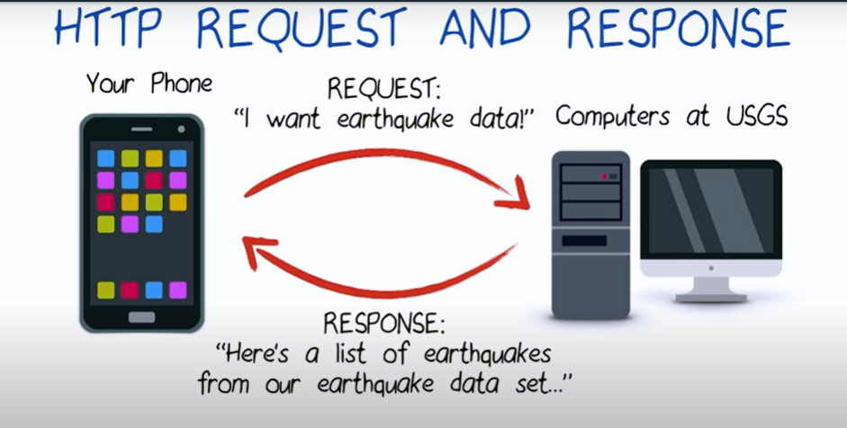
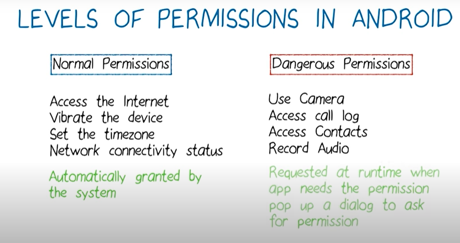

# Lesson 2: Http Networking

<p align="center">
  
</p>

## http request
<p align="center">
  
</p>

## Android permission 

### `<uses-permission android:name="android.permission.INTERNET" />`
### `<uses-permission android:name="android.permission.ACCESS_NETWORK_STATE" />`
### Note: Both the Internet and ACCESS_NETWORK_STATE permissions are normal permissions, which means they're granted at install time and don't need to be requested at runtime.
<p align="center">
  
</p>


## Http Methods

### Get : get info from server
### Post : post some info 
### Put : update some info
### Delete: delete some info

## Http Request for data

### 1. create url (string to url object)


```java
      private URL createUrl(String stringUrl) {
            URL url = null;
            try {
                url = new URL(stringUrl);
            } catch (MalformedURLException exception) {
                Log.e(LOG_TAG, "Error with creating URL", exception);
                return null;
            }
            return url;
        }
```

### create connection 

#### Status code : 200 -> successfull
#### status code : 404 -> Error page not found
#### status code : 500 -> server Error

```java
        private String makeHttpRequest(URL url) throws IOException {
            String jsonResponse = "";
            HttpURLConnection urlConnection = null;                  
            InputStream inputStream = null;
            try {
                urlConnection = (HttpURLConnection) url.openConnection();         //HttpURLConnection
                urlConnection.setRequestMethod("GET");                            // Method
                urlConnection.setReadTimeout(10000 /* milliseconds */);
                urlConnection.setConnectTimeout(15000 /* milliseconds */);       // setting up the request for data
                urlConnection.connect();                                         // get connected to the server : opens the communication link to the resource
                if(urlConnection.getResponseCode()==200) {
                    inputStream = urlConnection.getInputStream();               // getting response if statuscode=200
                    jsonResponse = readFromStream(inputStream);
                }
            } catch (IOException e) {
                // TODO: Handle the exception
            } finally {
                if (urlConnection != null) {
                    urlConnection.disconnect();
                }
                if (inputStream != null) {
                    // function must handle java.io.IOException here
                    inputStream.close();
                }
            }
            return jsonResponse;                                           //json response
        }
        
        
        
        /** reading data from inputStream and convert it into string object **/
        private static String readFromStream(InputStream inputStream) throws IOException {       //inputStream -> raw binary data
        StringBuilder output = new StringBuilder();
        if (inputStream != null) {
            InputStreamReader inputStreamReader = new InputStreamReader(inputStream, Charset.forName("UTF-8"));   // allows you to read single character at a time
            BufferedReader reader = new BufferedReader(inputStreamReader);                                        // wrap it into buffered reader for fast reading
            String line = reader.readLine();                                                                       //readLine
            while (line != null) {
                output.append(line);
                line = reader.readLine();
            }
        }
        return output.toString();
    }

```


