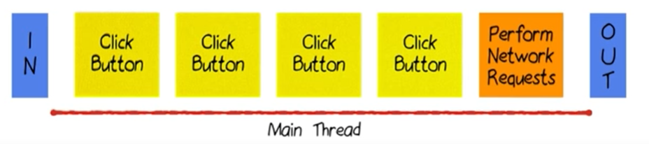
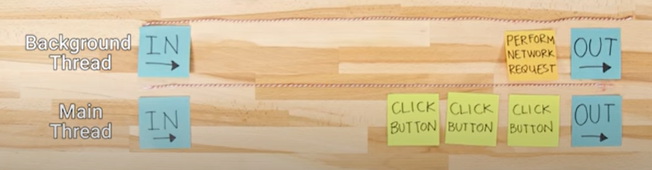
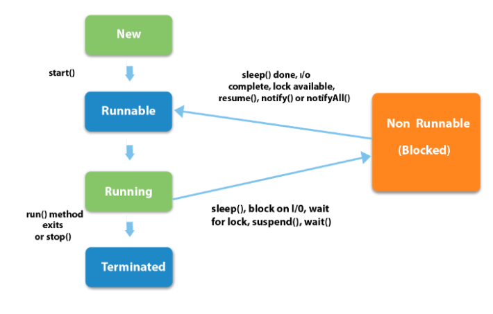

# Lesson 3: Threads and Parallelism

1. **NetworkOnMainThreadException :** doing network operation on main thread/ ui thread(which is no allowed).


## Threads

1. A threads performed a process/task at a time.
2. Tasks are scheduled in a queue.
<p align="center">
       
  </p>
  
3. Network request time is uncertain and might take long processing time to execute the task.
4. thus, blocks other operation in Ui thread and result in ANR( Application Not Responding).
5. So, Network operation are not allowed in main/ui thread.

### NOTE : DONOT BLOCK MAIN THREAD ( if the UI thread is blocked for more than a few seconds (about 5 seconds currently) the user is presented with the infamous "application not responding" (ANR) dialog. The user might then decide to quit your application and uninstall it if they are unhappy.)
## ("background" or "worker" threads).
<p align="center">
       
</p>

1. Create seperate thread to process Network operation and remove the thread after it completes the operation. 


## Multi-Threaded Android: Handler, Thread, Looper, and Message Queue   

### (AsyncTask  is is deprecating because it leads to memory leak problem)

### blog : https://betterprogramming.pub/a-detailed-story-about-handler-thread-looper-message-queue-ac2cd9be0d78

1. A thread can be defined as the path followed when executing a program. The Java virtual machine allows an application to have multiple threads of execution running concurrently.
2. Concurrency means running multiple tasks in parallel, it is one of the main reasons that we use threads. As Android is a single-threaded model, we need to create different threads to perform our task and post the result to the main thread where the UI gets updated.

# Threads
1. We can create threads in two ways.

```java
class Test extends Thread {
    @Override
    public void run() {
        Log.d("Threading", "Test class thread is         .     .     >"+Thread.currentThread().getName());
    }
}
```

```java
  class Test implements Runnable {
    @Override
    public void run() {
        Log.d("Test", "Test class thread is >"+Thread.currentThread().getName());
    }
}

new Test().start()
```

<p align="center">
       
       </p>
       
       
### We can perform any kind of operation inside threads except updating the UI elements. To update a UI element from a thread, we need to use either the handler or the runOnUIThread method.
```java
private void yourMethodName(){
new Thread(new Runnable() {
    @Override
    public void run() {
            try {
             yourActivity.runOnUiThread(new Runnable() {
             @Override
             public void run() {
                    txtview.setText("some value");
                    edittext.setText("some new value");
             }
             });
            }catch (Exception e) {
                  //print the error here
            }
      }
 }).start();
}
```
## Handler

```java

           Handler handler=new Handler(Looper.getMainLooper()){               // handler associate to main thread looper
            @Override
            public void handleMessage(@NonNull Message msg) {                // handles the message
                super.handleMessage(msg);

                String response = msg.getData().getString("result");
                ArrayList<Earthquake> earthquakes=QueryUtils.extractEarthquakes(response);
                uiUpdate(earthquakes);
            }
        };

        Thread thread=new Thread(){                              // worker thread or background thread                         
            @Override
            public void run() {                                 // can't update ui from here 
                super.run();

                URL url=QueryUtils.createUrl(USGS_REQUEST);
                String response="";
                try{
                    response=QueryUtils.makeHttpRequest(url);
                }
                catch (Exception e)
                {
                    response="";
                }
                if(QueryUtils.isEmpty(response))
                {
                    response="";
                }

                Message msg = new Message();                      // Message creation
                Bundle data = new Bundle();
                data.putString("result",response);
                msg.setData(data);
                handler.sendMessage(msg);                         // push msg to main thread message queue.

            }
        };
        thread.start();                                           //starts thread
```


