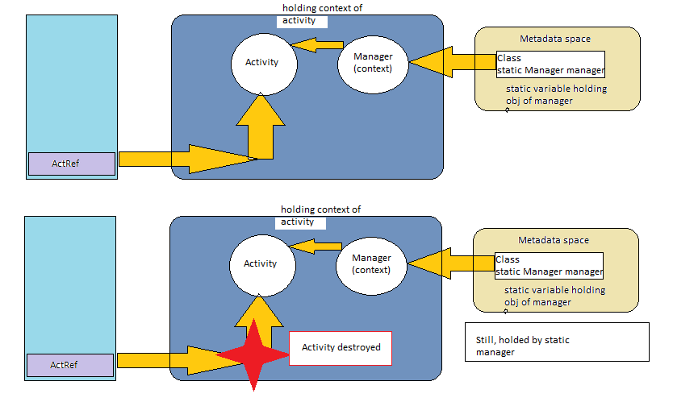

# Q1. Where does nativeLib mapped  inside Android device?


```xml
AndroidManifest.xml

<application
        android:allowBackup="true"
        ....
        android:theme="@style/Theme.MiwokApp"
        android:extractNativeLibs="true"
        >
</application>
```

## Avoid extracting native libraries 
When building the release version of your app, package uncompressed .so files in the APK by setting android:extractNativeLibs="false" in the <application> element of your app's manifest. Disabling this flag prevents PackageManager from copying .so files from the APK to the filesystem during installation and has the added benefit of making updates of your app smaller. When building your app using Android Gradle plugin 3.6.0 or higher, the plugin sets this property to "false" by default.

# Q2. Memory Leak and Common causes ?
## res: https://proandroiddev.com/everything-you-need-to-know-about-memory-leaks-in-android-d7a59faaf46a

### Failure to release unused object from the memory.
### Type1 : leaks that occupy the memory unit until the end of the application, and 
### Type 2: leaks that occupy the memory unit until the end of the method.
        
## Causes
### static variable (type1)
```java    
  public class Manager
  {   Context mContext;
       Manager(Context context)
        { mContext=context;
        }
    }
 ```
```java    
  public class MainActivity extend AppCompatActivity
  {
        public static Manager manager;
        onCreate()
        {
            manager=new Manager(this);
        }
    }
 ```
 ### Solution : use Application Context, unintialised variable on destroy, or avoid using static variable.


 ### Incorrect use of a thread cause a leak (type 2)
        
 ```java
   public class ThreadActivity extends Activity {

    @Override
    protected void onCreate(Bundle savedInstanceState) {
        //...
        new DownloadTask().start();
    }
    
    private class DownloadTask extends Thread {
        @Override
        public void run() {
           SystemClock.sleep(2000 * 10);
        }
    }
}
```
## solution: stop thread on Activity destroy, use static class with weak reference.

### Listeners  
If you forget to unregistered activity to a Service whose lifecycle is more than activity's lifecycle, it would create a memory leak.


        
    
