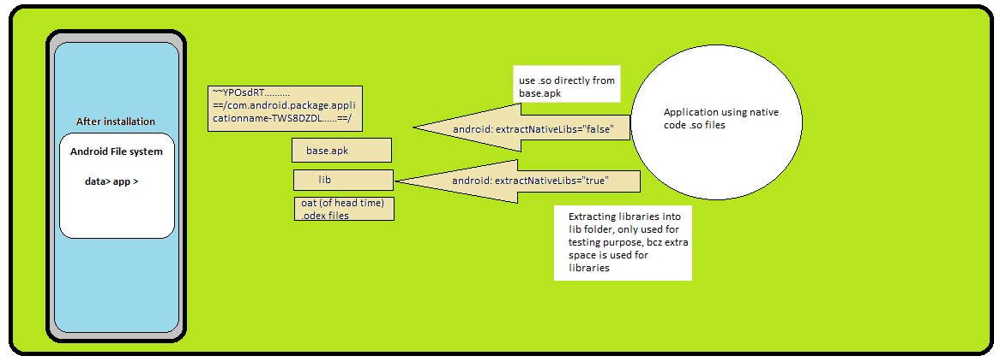

# Q1. Where does nativeLib mapped  inside Android device?


```xml
AndroidManifest.xml

<application
        android:allowBackup="true"
        ....
        android:theme="@style/Theme.MiwokApp"
        android:extractNativeLibs="true"
        >
</application>

```
