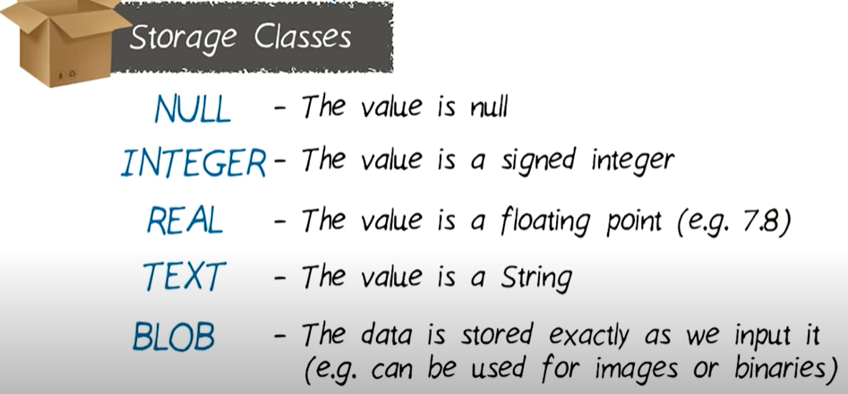

# DATA STORAGE
## cheat sheet : https://github.com/mohit1018102/Android_Resource/blob/main/Data%20Storage/sql-sqlite-commands-cheat-sheet.pdf
## Sqlite
**Lite weighted sql database preinstalled in mobile devices**
1. SQL: Structured query language
2. use to store data in organised manner.
3. arrange data in tables( row and columns)
<p align="center"></p>

### Some of The Most Important SQL Commands
1. SELECT - extracts data from a database
2. UPDATE - updates data in a database
3. DELETE - deletes data from a database
4. INSERT INTO - inserts new data into a database
5. CREATE DATABASE - creates a new database
6. ALTER DATABASE - modifies a database
7. CREATE TABLE - creates a new table
8. ALTER TABLE - modifies a table
9. DROP TABLE - deletes a table

### Create Database
```sql
    $sqlite3 DatabaseName.db
```
```sql
  //example
  $sqlite3 testDB.db
  SQLite version 3.7.15.2 2013-01-09 11:53:05
  Enter ".help" for instructions
  Enter SQL statements terminated with a ";"
  sqlite>
  sqlite>.quit //for 
```
### Create Table
```sql
  CREATE TABLE database_name.table_name(
   column1 datatype PRIMARY KEY(one or more columns),
   column2 datatype,
   column3 datatype,
   .....
   columnN datatype
);
```

```sql
   CREATE TABLE COMPANY(
   ID INT PRIMARY KEY     NOT NULL,
   NAME           TEXT    NOT NULL,
   AGE            INT     NOT NULL,
   ADDRESS        CHAR(50),
   SALARY         REAL
);

sql> .tables //to check tables
```

**Info about table**<br>

```sql
  PRAGMA TABLE_INFO(COMPANY);
```

### Drop table
```sql
   DROP TABLE COMPANY;
```

## CRUD( CREATE READ UPDATE DELETE)
1. CREATE : INSERT
2. READ : SELECT
3. UPDATE: UPDATE 
4. DELETE: DELETE

```sql
CREATE TABLE pets (_id INTEGER, 
                    name TEXT, 
                    breed TEXT, 
                    gender INTEGER, 
                    weight INTEGER
                    );
```

### INSERT(CREATE)
```sql
INSERT INTO pets(_id, name, breed, gender, weight) VALUES(2, "Garfield", "Tabby", 1, 8);
```
### Read
```sql
select * from pets;

select * from pets where _id==1;

select name,weight from pets 
where gender==1 
ORDER BY weight DESC;
```

### TABLE CONSTRAINT
1. PRIMARY KEY
2. AUTO INCREMENT
3. NOT NULL
4. DEFAULT<Value>  
```sql
    CREATE TABLE pets (
        _id INTEGER PRIMARY KEY AUTOINCREMENT,
        name TEXT NOT NULL,
        breed TEXT,
        gender INTEGER NOT NULL,
        weight INTEGER NOT NULL DEFAULT 0
    );
```

### UPDATE 
```sql
    UPDATE pets SET weight=20
    where _id==2;
```
    
### DELETE
```sql
    DELETE FROM pets 
    where _id==2;
```


