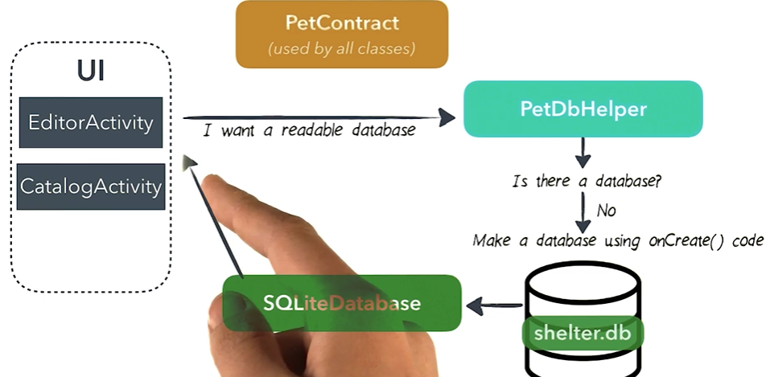
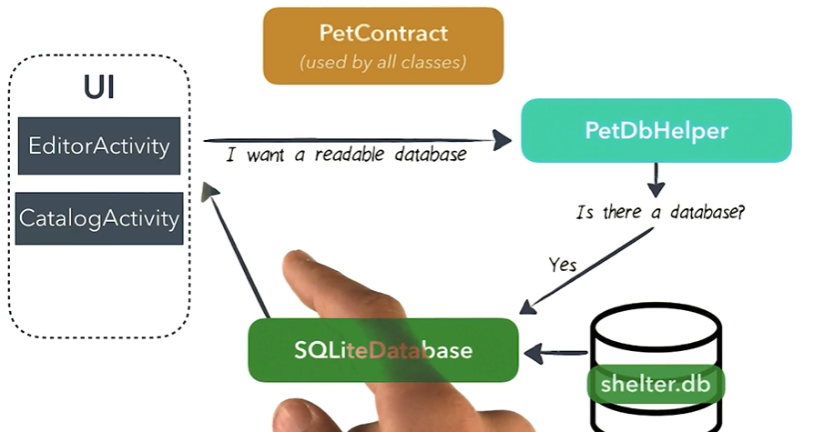
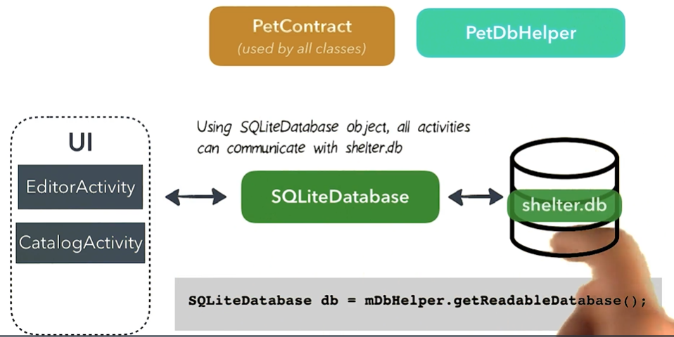
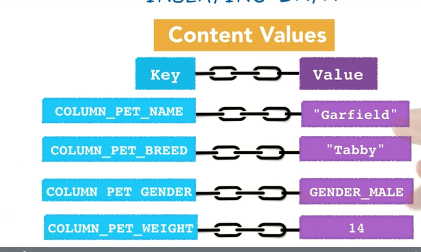

# Lesson 2 - Using a Database in an Android App
### git :https://github.com/udacity/ud845-Pets .

## UI-FAB
```XML
<com.google.android.material.floatingactionbutton.FloatingActionButton
        android:id="@+id/floatingActionButton"
        android:layout_width="wrap_content"
        android:layout_height="wrap_content"
        android:layout_alignParentRight="true"
        android:layout_alignParentBottom="true"

        android:layout_marginRight="20dp"
        android:layout_marginBottom="40dp"
        android:clickable="true"
        android:src="@drawable/ic_add_pet"
        app:backgroundTint="@color/colorPrimary" <--- bg color
        app:tint="@color/white"                  <--- icon color
        tools:ignore="MissingConstraints,SpeakableTextPresentCheck" />
```

## UI -Spinner

```xml
          <Spinner
                android:id="@+id/spinner_gender"
                android:layout_height="48dp"
                android:layout_width="wrap_content"
                android:paddingRight="16dp"
                android:spinnerMode="dropdown"/>
```

```xml
<!-- value> arrays.xml-->
<resources>
    <!-- These are the options displayed in the gender drop-down Spinner -->
    <string-array name="array_gender_options">
        <item>@string/gender_unknown</item>
        <item>@string/gender_male</item>
        <item>@string/gender_female</item>
    </string-array>
</resources>
```

```java

        private void setupSpinner() {
                  
                  // Create adapter for spinner. The list options are from the String array it will use
                  // the spinner will use the default layout
                  ArrayAdapter genderSpinnerAdapter = ArrayAdapter.createFromResource(this,
                                      R.array.array_gender_options, android.R.layout.simple_dropdown_item_1line);
                 
                 // Apply the adapter to the spinner
                 mGenderSpinner.setAdapter(genderSpinnerAdapter);

    }

```

# steps to create DB

## 1. SCHEMA AND CONTRACT CLASS

```sql
SCHEMA

CREATE TABLE pets
( _id INTEGER AUTOINCREMENT PRIMARYKEY,
  name TEXT,
  breed TEXT,
  gender INTEGER,
  weight REAL
);
  
```

#### Contract class
1. A contract class is a container for constants that define names for URIs, tables, and columns. 
2. The contract class allows you to use the same constants across all the other classes in the same package.
3. This lets you change a column name in one place and have it propagate throughout your code.

```java
/** Note: By implementing the BaseColumns interface, your inner class can inherit a primary key field 
called _ID that some Android classes such as CursorAdapterexpect it to have. It's not required, 
but this can help your database work harmoniously with the Android framework.
**/
public final class PetContract {


public static final String SQL_CREATE_ENTRIES ="CREATE TABLE "+ PetEntry.TABLE_NAME+
            "("+ PetEntry._ID+" INTEGER PRIMARY KEY AUTOINCREMENT,"
              +PetEntry.COLUMN_PET_NAME +" TEXT NOT NULL,"
              +PetEntry.COLUMN_PET_BREED+ " TEXT,"
              +PetEntry.COLUMN_PET_GENDER+ " INTEGER NOT NULL,"
              +PetEntry.COLUMN_PET_WEIGHT+ " INTEGER NOT NULL DEFAULT 0"
            +")";

    public static final String SQL_DELETE_ENTRIES =
            "DROP TABLE IF EXISTS " + PetEntry.TABLE_NAME;

    private PetContract()
    {
    }

    public static class PetEntry implements BaseColumns
    {
        //********table*************
        public static final String TABLE_NAME="pets";
        public static final String _ID=BaseColumns._ID;
        public static final String COLUMN_PET_NAME="name";
        public static final String COLUMN_PET_BREED="breed";
        public static final String COLUMN_PET_GENDER="gender";
        public static final String COLUMN_PET_WEIGHT="weight";

        //*********gender**********
        public static final int GENDER_UNKNOWN=0;
        public static final int GENDER_MALE=1;
        public static final int GENDER_FEMALE=2;

    }
}
```

## 2. create Database using SQLiteOpenHelper
1. Android provides a class that help us create, open and manage db and that class is SQLiteOpenHelper class.
2. what does this class do:
        * create a sqlite database when it is first accessed.
        * next times when user opens the app, Gives you a connection to that database.
        * Manages updating the database schema if version changes
3. Todo:
      * create a class that extends SQLiteOpenHelper.
      * create constants for database name and database version
      * create a constructor
      * implement onCreate()- this method is for when the database create for first time.
      * implement onUpgrade()- this method is for when the db schema of the db changes.(ex: adding new column).
 
 ## open app for first time: creates db 
 <p align="center">
        
  </p>
  
 ## second time
 <p align="center">
        
  </p>
  
  #### On the device, go to Settings > Apps > Find the app in question > Clear Cache. This erases any pre-existing sqlite database for the app.
  
   ## use SQLiteDatabase obj to communicate with database
 <p align="center">
        
  </p>
  


```java

public class PetDbHelper extends SQLiteOpenHelper {

    public static final int DATABASE_VERSION = 1;
    public static final String DATABASE_NAME = "mypets.db";

    public PetDbHelper(Context context)
    {
        super(context, DATABASE_NAME, null, DATABASE_VERSION);
    }

    @Override
    public void onCreate(SQLiteDatabase db) {

        db.execSQL(PetContract.SQL_CREATE_ENTRIES);

    }

    @Override
    public void onUpgrade(SQLiteDatabase db, int oldVersion, int newVersion) {
        // This database is only a cache for online data, so its upgrade policy is
        // to simply to discard the data and start over
        db.execSQL(PetContract.SQL_DELETE_ENTRIES);
        onCreate(db);

    }

    @Override
    public void onDowngrade(SQLiteDatabase db, int oldVersion, int newVersion) {
        onUpgrade(db, oldVersion, newVersion);
    }
}

```

```java
// to check the db 

 private void displayDatabaseInfo()
    {
        PetDbHelper dbHelper=new PetDbHelper(this);
        SQLiteDatabase db=dbHelper.getReadableDatabase();
        Cursor cursor=null;

        try{
            cursor=db.rawQuery("SELECT * FROM "+ PetEntry.TABLE_NAME,null);

            Toast.makeText(this,cursor.getColumnCount()+" "+cursor.getCount(),Toast.LENGTH_LONG).show();
        }
        catch (Exception e)
        {
            Toast.makeText(this,"failed!!!",Toast.LENGTH_LONG).show();

        }
        finally {
            cursor.close();
            db.close();
        }

    }
```


### Database stored inside------>    /data/com.technomaniacs.android.mypet/databases/mypets.db    : you can see it on your rooted device

## Inserting value using content values

<p align="center">
        
 </p>
 
 
 ```java
 
 private void  insertData()
    {    PetDbHelper dbHelper=new PetDbHelper(this);
        SQLiteDatabase db = dbHelper.getWritableDatabase();

       // Create a new map of values, where column names are the keys
        ContentValues values = new ContentValues();
        values.put(PetEntry.COLUMN_PET_NAME,"dummy dog");
        values.put(PetEntry.COLUMN_PET_BREED,"dummy");
        values.put(PetEntry.COLUMN_PET_GENDER,0);
        values.put(PetEntry.COLUMN_PET_WEIGHT,32);


        // Insert the new row, returning the primary key value of the new row
        long newRowId = db.insert(PetEntry.TABLE_NAME, null, values);//returns id otherwise -1
    }
```

## Query

```java
SQLiteDatabase db = dbHelper.getReadableDatabase();

// Define a projection that specifies which columns from the database
// you will actually use after this query.
String[] projection = {
    BaseColumns._ID,
    FeedEntry.COLUMN_NAME_TITLE,
    FeedEntry.COLUMN_NAME_SUBTITLE
    };

// Filter results WHERE "title" = 'My Title'
String selection = FeedEntry.COLUMN_NAME_TITLE + " = ?";
String[] selectionArgs = { "My Title" };

// How you want the results sorted in the resulting Cursor
String sortOrder =
    FeedEntry.COLUMN_NAME_SUBTITLE + " DESC";

Cursor cursor = db.query(
    FeedEntry.TABLE_NAME,   // The table to query
    projection,             // The array of columns to return (pass null to get all)
    selection,              // The columns for the WHERE clause
    selectionArgs,          // The values for the WHERE clause
    null,                   // don't group the rows
    null,                   // don't filter by row groups
    sortOrder               // The sort order
    );
```

### Cursor is the Interface which represents a 2 dimensional table of any database. When you try to retrieve some data using SELECT statement, then the database will first create a CURSOR object and return its reference to you.

### The pointer of this returned reference is pointing to the -1th location which is otherwise called as before first location of the Cursor, so when you want to retrive data from the cursor, you have to first move to the first record so we have to use moveToFirst

```java
private void displayDatabaseInfo()
    {
        PetDbHelper dbHelper=new PetDbHelper(this);
        SQLiteDatabase db=dbHelper.getReadableDatabase();
        Cursor cursor=null;
        String[] projection = {
                PetEntry._ID,
                PetEntry.COLUMN_PET_NAME,
                PetEntry.COLUMN_PET_BREED,
                PetEntry.COLUMN_PET_GENDER
        };


    try{
        cursor = db.query(
                PetEntry.TABLE_NAME,   // The table to query
                projection,             // The array of columns to return (pass null to get all)
                null,              // The columns for the WHERE clause
                null,          // The values for the WHERE clause
                null,                   // don't group the rows
                null,                   // don't filter by row groups
                null               // The sort order
        );

           int nameid=cursor.getColumnIndex(PetEntry.COLUMN_PET_NAME);

          cursor.moveToLast();

            Toast.makeText(this,cursor.getString(nameid)+" "+cursor.getCount(),Toast.LENGTH_LONG).show();
        }
        catch (Exception e)
        {
            Toast.makeText(this,"failed!!!",Toast.LENGTH_LONG).show();

        }
        finally {
            cursor.close();
            db.close();
        }

    }
```


        


