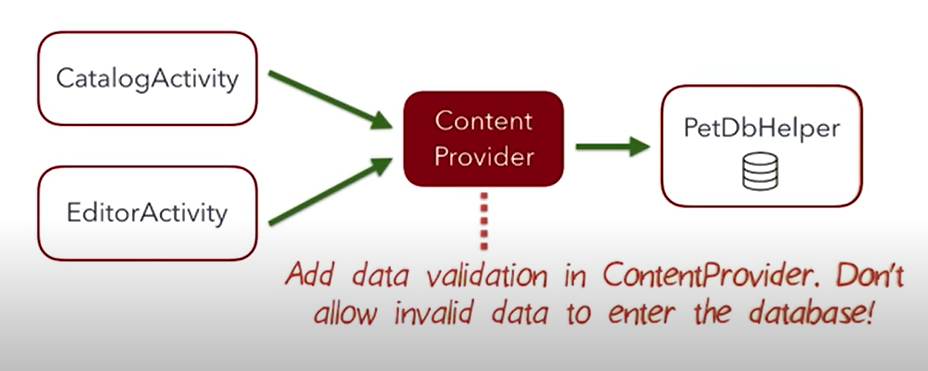
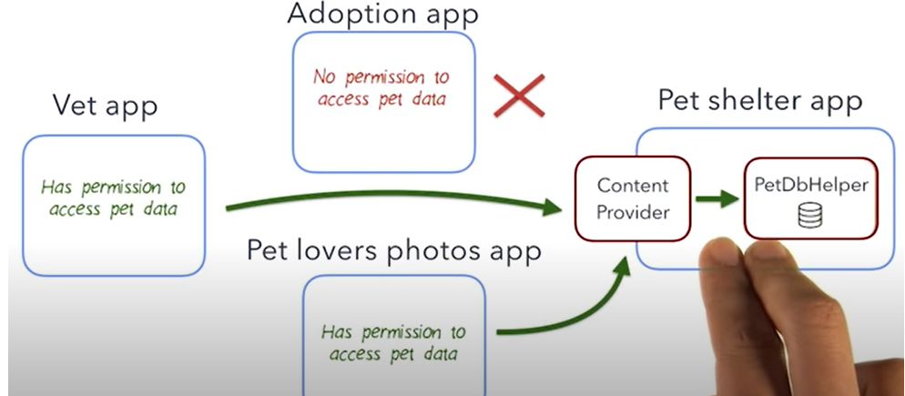
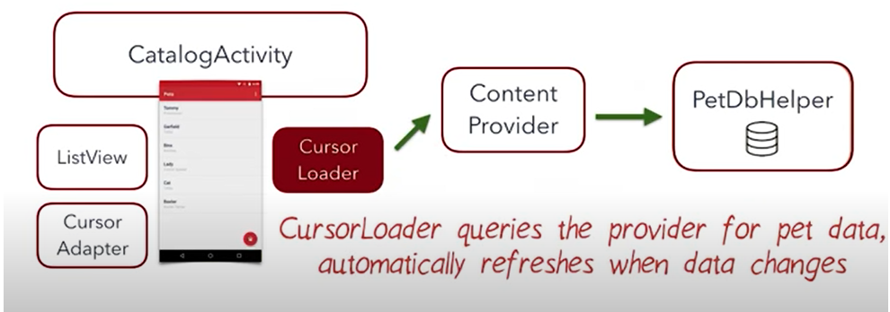
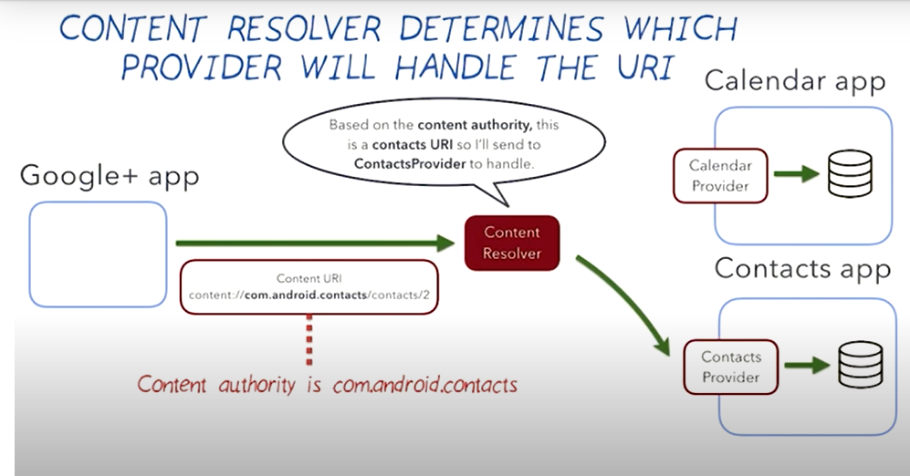
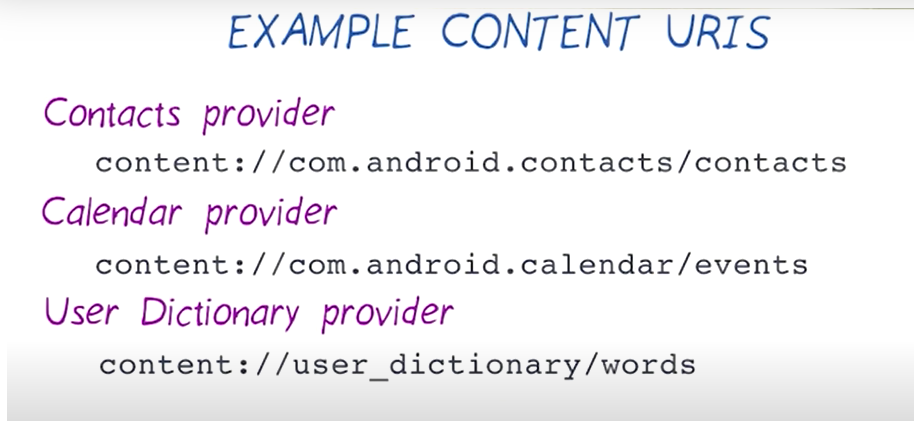
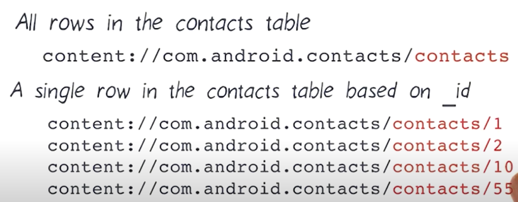
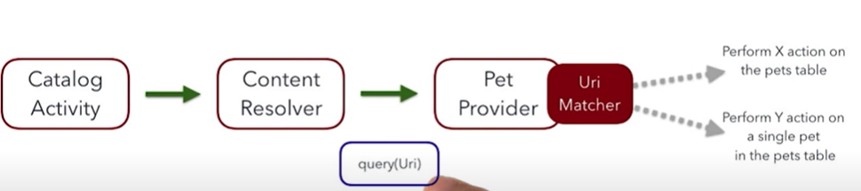
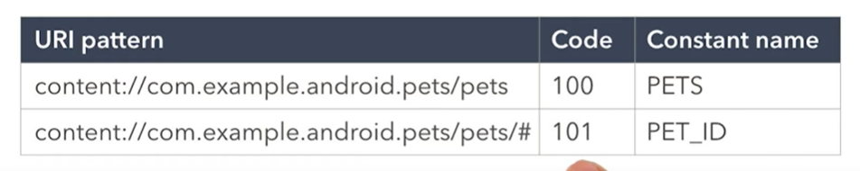
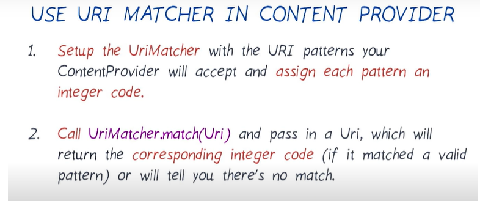

# CONTENT PROVIDER
## Good abstraction layer between data source and UI code ( can add data validation, can modify how data is stored and UI Code is uneffected).

<p align="center">
        
  </p>
  
 
 
 ## content provider is an android component that is used to share data.
  <p align="center">
        
  </p>
  
 ## works wells with other android framework.
 
 <p align="center">
        
  </p>
  


# Content Resolver

 <p align="center">
        
  </p>
  
## Step 1: Adding ContentProvider to the App
#### https://developer.android.com/reference/android/content/ContentProvider.html?utm_source=udacity&utm_medium=course&utm_campaign=android_basics

```xml
AndroidManifest.xml

<application>
    <provider
            android:name=".db.PetProvider"
            android:authorities="com.technomaniacs.android.mypet"       // uniquely identifies the content provider on the device
            android:exported="false"                                    // exported to other apps or not
            />
</application>
```
```java
public class PetProvider extends ContentProvider {
    @Override
    public boolean onCreate() {
        return false;
    }

    @Nullable
    @Override
    public Cursor query(@NonNull Uri uri, @Nullable String[] projection, @Nullable String selection, @Nullable String[] selectionArgs, @Nullable String sortOrder) {
        return null;
    }

    @Nullable
    @Override
    public String getType(@NonNull Uri uri) {
        return null;
    }

    @Nullable
    @Override
    public Uri insert(@NonNull Uri uri, @Nullable ContentValues values) {
        return null;
    }

    @Override
    public int delete(@NonNull Uri uri, @Nullable String selection, @Nullable String[] selectionArgs) {
        return 0;
    }

    @Override
    public int update(@NonNull Uri uri, @Nullable ContentValues values, @Nullable String selection, @Nullable String[] selectionArgs) {
        return 0;
    }
}
```

## Step 2: Designing Pet Uri ( uniform resource Identifier )
### used to identify data
<p align="center">
        
         
               
               
</p>

```java

public final class PetContract {

   .......
    public static final String CONTENT_AUTHORITY = "com.technomaniacs.android.mypet";
    public static final Uri BASE_CONTENT_URI = Uri.parse("content://" + CONTENT_AUTHORITY);
    public static final Uri CONTENT_URI = Uri.withAppendedPath(BASE_CONTENT_URI, PetEntry.TABLE_NAME);
    .....
}

```

# URI Matcher

## content://com.technomaniacs.android.mypet/# --> number of any length
## content://com.technomaniacs.android.mypet/* --> string of any length

<p align="center">
        
        
        
</p>

```java

    /** URI matcher code for the content URI for the pets table */
    private static final int PETS = 100;

    /** URI matcher code for the content URI for a single pet in the pets table */
    private static final int PET_ID = 101;

    /**
     * UriMatcher object to match a content URI to a corresponding code.
     * The input passed into the constructor represents the code to return for the root URI.
     * It's common to use NO_MATCH as the input for this case.
     */
    private static final UriMatcher sUriMatcher = new UriMatcher(UriMatcher.NO_MATCH);
    static {
        sUriMatcher.addURI(PetContract.CONTENT_AUTHORITY, PetEntry.TABLE_NAME, PETS);
        sUriMatcher.addURI(PetContract.CONTENT_AUTHORITY, PetEntry.TABLE_NAME +"/#", PET_ID);
    }
```

## CP Query

```java
 public Cursor query(@NonNull Uri uri, @Nullable String[] projection, @Nullable String selection, @Nullable String[] selectionArgs, @Nullable String sortOrder) {
        SQLiteDatabase db=mPetDbHelper.getReadableDatabase();
        Cursor cursor=null;
        int id=sUriMatcher.match(uri);
        switch (id)
        {
            case PETS:
                break;
            case PET_ID:
                selection=PetEntry._ID+"=?";
                selectionArgs=new String[] {String.valueOf(ContentUris.parseId(uri))};
                break;
            default:
        }

        cursor= db.query(PetEntry.TABLE_NAME,projection,selection,selectionArgs,null,null,sortOrder);
        return cursor;
    }
    
   
    cursor=getContentResolver().query(PetContract.CONTENT_URI_ALL,projection,null,null,null);
 ```
 
 ## CP INSERT
 ```java
  private Uri insertPet(Uri uri,ContentValues contentValues)
    {
        SQLiteDatabase db = mPetDbHelper.getWritableDatabase();

        // Insert the new row, returning the primary key value of the new row
        long newRowId = db.insert(PetEntry.TABLE_NAME, null, contentValues);//returns id otherwise -1

        return (newRowId<0)?null:Uri.withAppendedPath(uri, String.valueOf(newRowId));
    }

    @Nullable
    @Override
    public Uri insert(@NonNull Uri uri, @Nullable ContentValues values) {

        final int match = sUriMatcher.match(uri);
        switch (match) {
            case PETS:
                return insertPet(uri,values);
            default:
                throw new IllegalArgumentException("Insertion is not supported for " + uri);
        }

    }
    
    
    Uri uri = getContentResolver().insert(PetContract.CONTENT_URI_ALL,values);//returns id otherwise -1
    return (uri==null)?-1: ContentUris.parseId(uri);
 ```
 
 ## Data validation
 
 ```java
  private boolean sanityCheck(ContentValues values)
    {
        String name = values.getAsString(PetEntry.COLUMN_PET_NAME);
        int gender = values.getAsInteger(PetEntry.COLUMN_PET_GENDER);
        int weight = values.getAsInteger(PetEntry.COLUMN_PET_WEIGHT);
        String result="";
        if(name.equals(""))
        {
            result+="name";
        }

        if(gender!=PetEntry.GENDER_FEMALE && gender!=PetEntry.GENDER_MALE &&  gender!=PetEntry.GENDER_UNKNOWN )
        {
            result+=", gender, ";
        }

        if(weight==-1)
        {
            result+=", weight";
        }

        if(result.length()!=0)
        {
            Toast.makeText(getContext().getApplicationContext(),"Invalid : "+result,Toast.LENGTH_SHORT).show();
            return false;
        }
        return true;

    }
 ```
 
 ## update
 
 ```java
 private int updateData(ContentValues values, String selection, String[] selectionArgs) {
        SQLiteDatabase db = mPetDbHelper.getWritableDatabase();

        return db.update(PetEntry.TABLE_NAME,values,selection,selectionArgs);

    }

    @Override
    public int update(@NonNull Uri uri, @Nullable ContentValues values, @Nullable String selection, @Nullable String[] selectionArgs) {
        if (sanityCheck(values)==false) return -1;
        int rowAffected=0;
        int id= sUriMatcher.match(uri);
        switch (id)
        {
            case PET_ID:
                selection=PetEntry._ID+"=?";
                selectionArgs=new String[] {String.valueOf(ContentUris.parseId(uri))};
                rowAffected=updateData(values,selection,selectionArgs);
                break;
            default: return -1;
        }
        return rowAffected;
    }
    
    
     Uri made=Uri.withAppendedPath(PetContract.CONTENT_URI_ALL, String.valueOf(1));
     int x=getContentResolver().update(made,values,null,null);
 ```
 
 ## delete
 
 ```java
  @Override
    public int delete(@NonNull Uri uri, @Nullable String selection, @Nullable String[] selectionArgs) {
        SQLiteDatabase db=mPetDbHelper.getWritableDatabase();
        int rowDeleted=0;
        int id=sUriMatcher.match(uri);
        switch (id)
        {
            case PETS:
                break;
            case PET_ID:
                selection=PetEntry._ID+"=?";
                selectionArgs=new String[] {String.valueOf(ContentUris.parseId(uri))};
                break;
            default:
        }
        rowDeleted=db.delete(PetEntry.TABLE_NAME,selection,selectionArgs);
        return rowDeleted;
    }
    
    
    int row=getContentResolver().delete(PetContract.CONTENT_URI_ALL,null,null);
    Toast.makeText(getApplicationContext(),"All data deleted : row count "+row,Toast.LENGTH_SHORT).show();
```

## getType()

### This ContentProvider's getType() method is used mostly when you allow your ContentProvider to interact with other third party applications. This MIME Type is used by Android System to find which applications can handle it.
```java

public static final String CONTENT_TYPE = "vnd.android.cursor.dir/contact";
 @Override
      public String getType(Uri uri) {
          final int match = sUriMatcher.match(uri);
          switch (match) {
              case PETS:
                  return PetEntry.CONTENT_LIST_TYPE;
              case PET_ID:
                  return PetEntry.CONTENT_ITEM_TYPE;
              default:
                  throw new IllegalStateException("Unknown URI " + uri + " with match " + match);
          }
      }
```


 
