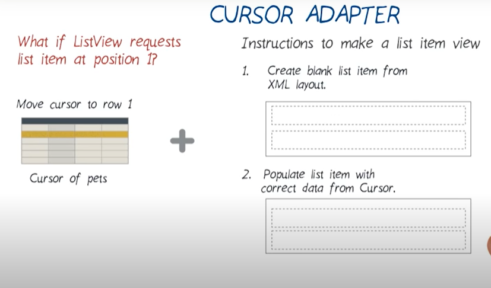
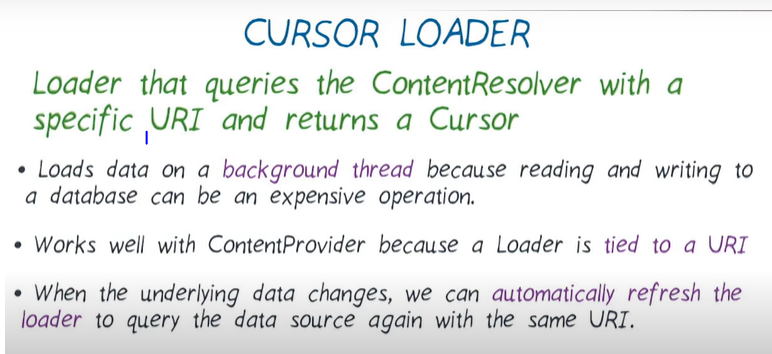
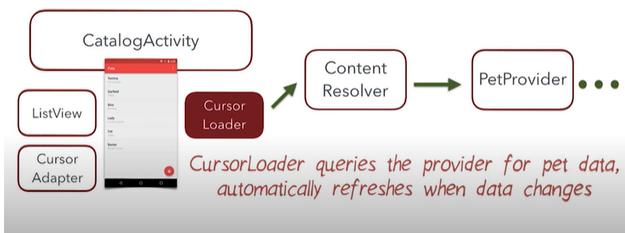
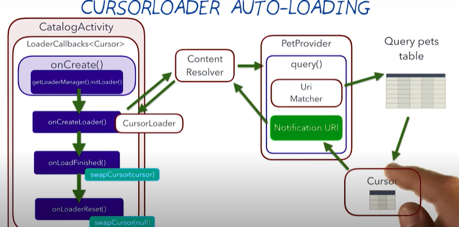

# Cursor Loader

## Cursor Adapter
### https://github.com/codepath/android_guides/wiki/Populating-a-ListView-with-a-CursorAdapter
<p align="center">
  
  
 
</p>

### sometimes listview won't call new View(), and recycle old view which is not visible to user.

```xml
AndroidManifest.xml
<ImageView
        android:layout_width="50dp"
        android:layout_height="match_parent"
        android:layout_gravity="center"
        android:background="@color/colorPrimaryDark"
        android:src="@drawable/ic_add_pet"/>

    <LinearLayout
        android:layout_width="match_parent"
        android:layout_height="match_parent"
        xmlns:tools="http://schemas.android.com/tools"
        android:minHeight="60dp"
        android:background="#FFB300"
        android:gravity="center_vertical"
        android:orientation="vertical">
    <TextView
        android:id="@+id/text_pet_name"
        android:layout_height="wrap_content"
        android:layout_width="wrap_content"
        android:gravity="left"
        android:fontFamily="sans-serif-condensed-medium"
        tools:text="Tabby"
        android:textColor="@color/black"
        android:textSize="16sp"
        android:layout_marginLeft="20dp"
        />

    <TextView
        android:id="@+id/text_pet_breed"
        android:layout_height="wrap_content"
        android:layout_width="wrap_content"
        android:gravity="left"
        tools:text="tabby"

        android:fontFamily="sans-serif-condensed-medium"
        android:textSize="16sp"
        android:layout_marginLeft="20dp"
        />
    </LinearLayout>


</LinearLayout>
```

```java

public class PetCursorAdapter extends CursorAdapter {
    public PetCursorAdapter(Context context, Cursor c) {
        super(context, c,0);
    }

    @Override
    public View newView(Context context, Cursor cursor, ViewGroup parent) {
        return LayoutInflater.from(context).inflate(R.layout.pet_list_view_item, parent, false);
    }

    @Override
    public void bindView(View view, Context context, Cursor cursor) {

        TextView name=view.findViewById(R.id.text_pet_name);
        TextView breed=view.findViewById(R.id.text_pet_breed);
        String  petName= cursor.getString(cursor.getColumnIndexOrThrow(PetEntry.COLUMN_PET_NAME));
        String petBreed = cursor.getString(cursor.getColumnIndexOrThrow(PetEntry.COLUMN_PET_BREED));
        name.setText(petName);
        name.setText(petBreed);
    }
}
```

## Cursor Loader
### Loader that queries the ContentResolver with a specify URI and return a cursor.
### Loads data in background thread bcz reading and writing to database can be an expensive operation.

<p align="center">
  
   
  
  
</p>

```java
public class CatalogActivity extends AppCompatActivity implements LoaderManager.LoaderCallbacks<Cursor>{
...

 private void init()
    {
        getSupportLoaderManager().initLoader(PET_LOADER, null, this);
        ...
     }
     
     
  /** cursor loader **/

    @NonNull
    @Override
    public Loader<Cursor> onCreateLoader(int loaderID, @Nullable Bundle args) {
        PetDbHelper dbHelper=new PetDbHelper(this);
        SQLiteDatabase db=dbHelper.getReadableDatabase();
        Cursor cursor=null;
        String[] projection = {
                PetEntry._ID,
                PetEntry.COLUMN_PET_NAME,
                PetEntry.COLUMN_PET_BREED,
        };
        switch (loaderID) {
            case PET_LOADER:
                // Returns a new CursorLoader
                return new CursorLoader(
                        this,   // Parent activity context
                        PetContract.CONTENT_URI_ALL, // Table to query
                        projection,     // Projection to return
                        null,            // No selection clause
                        null,            // No selection arguments
                        null             // Default sort order
                );
            default:
                // An invalid id was passed in
                return null;
        }

    }

    @Override
    public void onLoadFinished(@NonNull Loader<Cursor> loader, Cursor data) {
        if(data.getCount()>0)
        {   mEmptyView.setVisibility(View.GONE);
            mPetCursorAdapter.swapCursor(data);
        }
        else
        {
            mEmptyView.setVisibility(View.VISIBLE);
        }

    }

    @Override
    public void onLoaderReset(@NonNull Loader<Cursor> loader) {
        mPetCursorAdapter.swapCursor(null); // called when data need to be deleted.
    }
```

## AutoLoading

<p align="center">
  
 </p>
 
 ```java
 
 public Cursor query(@NonNull Uri uri, @Nullable String[] projection, @Nullable String selection, @Nullable String[] selectionArgs, @Nullable String sortOrder) {
        SQLiteDatabase db=mPetDbHelper.getReadableDatabase();
        Cursor cursor=null;
        ....

        cursor= db.query(PetEntry.TABLE_NAME,projection,selection,selectionArgs,null,null,sortOrder);
        // Set notification URI on the Cursor,
        // so we know what content URI the Cursor was created for.
        // If the data at this URI changes, then we know we need to update the Cursor.
        cursor.setNotificationUri(getContext().getContentResolver(), uri);
        return cursor;
    }
    
    private Uri insertPet(Uri uri,ContentValues contentValues)
    {
        SQLiteDatabase db = mPetDbHelper.getWritableDatabase();

        // Insert the new row, returning the primary key value of the new row
        long newRowId = db.insert(PetEntry.TABLE_NAME, null, contentValues);//returns id otherwise -1
        // Notify all listeners that the data has changed for the pet content URI
        if(newRowId>=0) getContext().getContentResolver().notifyChange(uri, null);   /// notify changes
        return (newRowId<0)?null:Uri.withAppendedPath(uri, String.valueOf(newRowId));
    }
```


